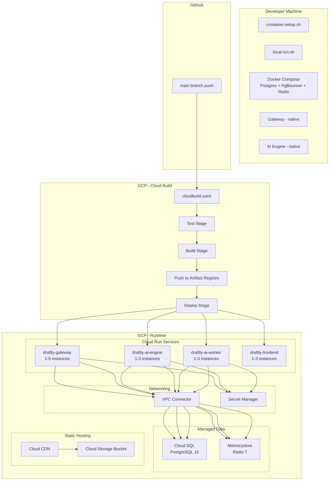
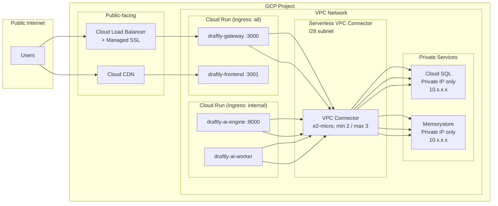
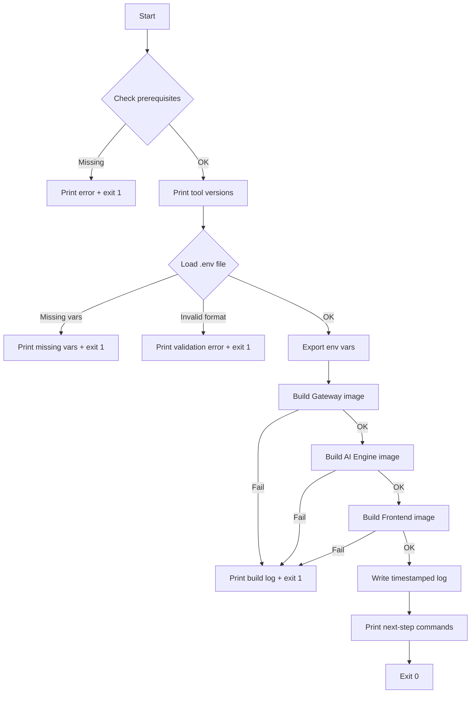
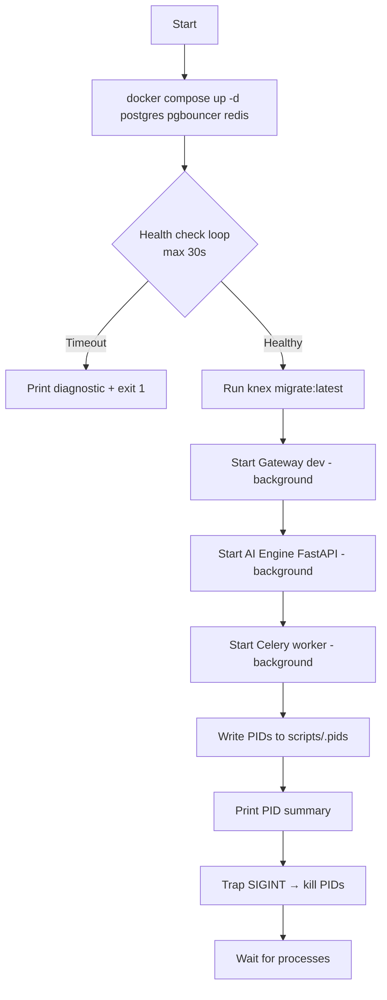

# Design Document: GCP Deployment Strategy

## Overview

This design defines the deployment infrastructure for Draftly on Google Cloud Platform. It covers three operational modes:

1. **Local containerized build** — `scripts/container-setup.sh` validates the environment, builds all Docker images, and outputs actionable logs
2. **Local hybrid development** — `scripts/local-run.sh` runs infrastructure (Postgres, PgBouncer, Redis) in Docker while application services run natively for hot-reload
3. **GCP production deployment** — Cloud Build CI/CD pipeline that tests, builds, pushes, and deploys to Cloud Run with managed Cloud SQL, Memorystore, and Cloud CDN

The target scale is 1000 users with ~300 peak concurrent connections. The design prioritizes simplicity and clear documentation for developers new to cloud deployment.

## Architecture

### High-Level Deployment Architecture



### GCP Networking Architecture



### Key Architectural Decisions

| Decision | Choice | Rationale |
|----------|--------|-----------|
| Container platform | Cloud Run | Serverless, scales to zero possible, no cluster management, pay-per-use |
| Database | Cloud SQL (PostgreSQL 16) | Managed backups, patching, private IP, familiar Postgres |
| Cache/Queue | Memorystore (Redis 7) | Managed Redis, private networking, compatible with Celery/BullMQ |
| CI/CD | Cloud Build | Native GCP integration, no external service needed, trigger on push |
| Image registry | Artifact Registry | GCP-native, regional, integrates with Cloud Build |
| Secrets | Secret Manager | Versioned, audited, native Cloud Run integration |
| Frontend hosting | Cloud Run (containerized) | Simpler deployment pipeline, consistent with other services. Cloud CDN + Storage available as optimization later |
| Worker deployment | Separate Cloud Run service | Isolates long-running AI tasks from health endpoint, independent scaling |
| Networking | Serverless VPC Access | Private connectivity without managing VPN or peering |

## Components and Interfaces

### 1. `scripts/container-setup.sh`

**Purpose:** Validate environment, build all Docker images, output logs.

**Interface:**
```bash
./scripts/container-setup.sh [--skip-validation] [--service gateway|ai-engine|frontend]
```

**Flow:**


**Prerequisites checked:**
- Docker (any recent version)
- Docker Compose v2+
- Node.js v20+
- Python v3.12+
- Poetry

### 2. `scripts/local-run.sh`

**Purpose:** Start infrastructure in Docker, run app services natively with PID tracking.

**Interface:**
```bash
./scripts/local-run.sh          # Start everything
./scripts/local-run.sh stop     # Kill tracked PIDs
```

**Flow:**


**PID file format (`scripts/.pids`):**
```
gateway=12345
ai-engine-api=12346
ai-engine-worker=12347
```

### 3. `cloudbuild.yaml`

**Purpose:** CI/CD pipeline triggered on push to main.

**Stages:**
1. **Test** — Run Gateway tests (`npm test`) and AI Engine tests (`pytest`) in parallel
2. **Build** — Build production Docker images for all 3 services + worker
3. **Push** — Tag with commit SHA + `latest`, push to Artifact Registry
4. **Deploy** — Deploy each service to Cloud Run with secrets and VPC connector

**Interface with GCP services:**
- Reads secrets from Secret Manager during deploy
- Pushes to `REGION-docker.pkg.dev/PROJECT_ID/draftly/SERVICE_NAME`
- Deploys to Cloud Run services with `--vpc-connector` and `--set-secrets` flags

### 4. `scripts/gcp-setup.sh`

**Purpose:** One-time GCP infrastructure provisioning for beginners.

**Interface:**
```bash
./scripts/gcp-setup.sh
```

**Resources provisioned:**
1. Enable required GCP APIs
2. Create VPC network + subnet
3. Create Serverless VPC Access connector
4. Create Cloud SQL instance (PostgreSQL 16, private IP)
5. Create Cloud SQL database + user
6. Create Memorystore instance (Redis 7)
7. Create Artifact Registry repository
8. Create Cloud Storage bucket (for frontend if using CDN)
9. Create secrets in Secret Manager
10. Create Cloud Build trigger

**Idempotency:** Each resource creation checks if it already exists and skips with a notice.

### 5. Frontend Dockerfile

**Purpose:** Multi-stage build for the React/Vite frontend.

```dockerfile
# Build stage
FROM node:20-alpine AS build
WORKDIR /app
COPY package*.json ./
RUN npm ci
COPY . .
ARG VITE_API_URL
ENV VITE_API_URL=$VITE_API_URL
RUN npm run build

# Production stage - serve with nginx
FROM nginx:alpine AS production
COPY --from=build /app/dist /usr/share/nginx/html
COPY nginx.conf /etc/nginx/conf.d/default.conf
EXPOSE 3001
CMD ["nginx", "-g", "daemon off;"]
```

### 6. Service Communication in GCP

| From | To | Method | Network Path |
|------|----|--------|--------------|
| User | Gateway | HTTPS | Public internet → Cloud Run |
| User | Frontend | HTTPS | Public internet → Cloud Run (or CDN) |
| Gateway | AI Engine | HTTP (internal) | Cloud Run → Cloud Run (internal URL) |
| Gateway | Cloud SQL | TCP:5432 | VPC Connector → Private IP |
| Gateway | Memorystore | TCP:6379 | VPC Connector → Private IP |
| AI Engine | Cloud SQL | TCP:5432 | VPC Connector → Private IP |
| AI Engine | Memorystore | TCP:6379 | VPC Connector → Private IP |
| AI Worker | Memorystore | TCP:6379 | VPC Connector → Private IP (queue polling) |
| AI Worker | Cloud SQL | TCP:5432 | VPC Connector → Private IP |
| Cloud Build | Artifact Registry | HTTPS | GCP internal |

## Data Models

### Environment Configuration Model

The deployment scripts work with the following configuration structure:

```typescript
// Conceptual model for environment validation
interface DeploymentConfig {
  // Required secrets (validated by container-setup.sh)
  GOOGLE_CLIENT_ID: string;
  GOOGLE_CLIENT_SECRET: string;
  SECRET_ENCRYPTION_KEY: string; // exactly 64 hex chars
  GEMINI_API_KEY: string;
  DB_PASSWORD: string;

  // Infrastructure (set by gcp-setup.sh output)
  GCP_PROJECT_ID: string;
  GCP_REGION: string; // e.g., "us-central1"
  CLOUD_SQL_CONNECTION_NAME: string; // project:region:instance
  MEMORYSTORE_HOST: string; // private IP
  VPC_CONNECTOR_NAME: string;
  ARTIFACT_REGISTRY_REPO: string;
}
```

### Cloud Build Substitution Variables

```yaml
substitutions:
  _REGION: us-central1
  _ARTIFACT_REPO: draftly
  _VPC_CONNECTOR: draftly-connector
  _CLOUD_SQL_INSTANCE: draftly-db
  _MEMORYSTORE_HOST: "10.0.0.3"  # Set by gcp-setup.sh
```

### PID Management Model

```bash
# scripts/.pids - written by local-run.sh
# Format: service_name=pid
gateway=<PID>
ai-engine-api=<PID>
ai-engine-worker=<PID>
```

### Cloud Run Service Configuration

| Service | Image | CPU | Memory | Min Instances | Max Instances | Ingress | Port |
|---------|-------|-----|--------|---------------|---------------|---------|------|
| draftly-gateway | gateway:latest | 1 vCPU | 512 MB | 1 | 5 | all | 3000 |
| draftly-ai-engine | ai-engine:latest | 2 vCPU | 1 GB | 1 | 3 | internal | 8000 |
| draftly-ai-worker | ai-engine:latest | 2 vCPU | 1 GB | 1 | 3 | internal | 8080 |
| draftly-frontend | frontend:latest | 1 vCPU | 256 MB | 0 | 3 | all | 3001 |

### Secret Manager Entries

| Secret Name | Used By | Description |
|-------------|---------|-------------|
| `draftly-google-client-id` | Gateway | Google OAuth client ID |
| `draftly-google-client-secret` | Gateway | Google OAuth client secret |
| `draftly-encryption-key` | Gateway | AES-256-GCM encryption key |
| `draftly-gemini-api-key` | AI Engine, AI Worker | LLM API key |
| `draftly-db-password` | All services | Cloud SQL password |
| `draftly-jwt-private-key` | Gateway | RS256 JWT signing key |
| `draftly-jwt-public-key` | Gateway | RS256 JWT verification key |


## Correctness Properties

*A property is a characteristic or behavior that should hold true across all valid executions of a system — essentially, a formal statement about what the system should do. Properties serve as the bridge between human-readable specifications and machine-verifiable correctness guarantees.*

### Property 1: Prerequisite detection correctness

*For any* subset of required tools (Docker, Docker Compose, Node.js 20+, Python 3.12+, Poetry) that are missing or below minimum version, the container-setup script's error output should contain the name and required version of every missing/outdated tool, and the script should exit with a non-zero status code.

**Validates: Requirements 1.1, 1.2**

### Property 2: Version summary completeness

*For any* environment where all prerequisite tools are present and meet minimum versions, the container-setup script's stdout should contain a version string for each of the 5 required tools.

**Validates: Requirements 1.3**

### Property 3: Environment variable validation completeness

*For any* subset of the required environment variables (GOOGLE_CLIENT_ID, GOOGLE_CLIENT_SECRET, SECRET_ENCRYPTION_KEY, GEMINI_API_KEY, DB_PASSWORD) that are missing or empty, the container-setup script's error output should list ALL missing variable names (not just the first), and the script should exit with a non-zero status code.

**Validates: Requirements 2.2, 2.3**

### Property 4: SECRET_ENCRYPTION_KEY format validation

*For any* string that is not exactly 64 hexadecimal characters (wrong length, non-hex characters, or empty), the container-setup script should reject it with a validation error. *For any* string that is exactly 64 hexadecimal characters, the script should accept it.

**Validates: Requirements 2.4**

### Property 5: .env file parsing round-trip

*For any* valid .env file containing key=value pairs (with optional quoting and comments), the parsing function should correctly extract all key-value pairs such that looking up a key returns the expected value.

**Validates: Requirements 2.1**

### Property 6: PID file completeness

*For any* set of successfully started background processes (gateway, ai-engine-api, ai-engine-worker), the scripts/.pids file should contain an entry for each process with a valid numeric PID, and the count of entries should equal the number of started processes.

**Validates: Requirements 5.5**

### Property 7: Secret Manager completeness

*For any* required secret (GOOGLE_CLIENT_ID, GOOGLE_CLIENT_SECRET, SECRET_ENCRYPTION_KEY, GEMINI_API_KEY, DB_PASSWORD), the gcp-setup script should include a creation command for that secret in Secret Manager.

**Validates: Requirements 12.1**

### Property 8: Ingress isolation

*For any* Cloud Run service that is not the Gateway or Frontend, the deployment configuration should specify internal-only ingress. Only the Gateway and Frontend services should accept public ingress.

**Validates: Requirements 13.3, 16.4**

### Property 9: Idempotent resource provisioning

*For any* GCP resource that already exists, the gcp-setup script should skip creation of that resource and print a notice rather than failing or creating a duplicate.

**Validates: Requirements 17.5**

## Error Handling

### Container Setup Script Errors

| Error Condition | Behavior | Exit Code |
|----------------|----------|-----------|
| Missing prerequisite tool | Print tool name + required version, exit | 1 |
| Missing .env file | Print "`.env` file not found in project root" | 1 |
| Missing required env var | Print all missing var names in one message | 1 |
| Invalid SECRET_ENCRYPTION_KEY | Print format requirement (64 hex chars) | 1 |
| Docker build failure | Print full build output, identify failing service | 2 |
| Docker daemon not running | Print "Docker daemon is not running. Start Docker Desktop." | 1 |

### Local Run Script Errors

| Error Condition | Behavior | Exit Code |
|----------------|----------|-----------|
| Docker Compose up failure | Print docker compose logs output | 1 |
| Health check timeout (30s) | Print which service failed + suggest checking logs | 1 |
| Migration failure | Print knex error output, kill any started services | 2 |
| Port already in use | Print which port is occupied + suggest `lsof -i :PORT` | 3 |
| SIGINT received | Kill all tracked PIDs, remove .pids file, exit | 0 |

### Cloud Build Pipeline Errors

| Error Condition | Behavior |
|----------------|----------|
| Test failure | Pipeline halts, Cloud Build reports failure with test output |
| Build failure | Pipeline halts, build logs available in Cloud Build console |
| Push failure | Pipeline halts, typically auth/permission issue |
| Deploy failure | Pipeline halts, Cloud Run error in logs (often resource limits or secret access) |

### GCP Setup Script Errors

| Error Condition | Behavior | Exit Code |
|----------------|----------|-----------|
| gcloud not installed | Print install instructions URL | 1 |
| gcloud not authenticated | Print `gcloud auth login` command | 1 |
| Insufficient permissions | Print required IAM roles | 1 |
| Resource already exists | Skip creation, print notice (not an error) | 0 |
| API not enabled | Enable it automatically with confirmation | 0 |
| Quota exceeded | Print quota details and suggest requesting increase | 1 |

## Testing Strategy

### Dual Testing Approach

This deployment feature requires both unit tests and property-based tests:

- **Unit tests**: Verify specific examples (valid .env parsing, specific error messages, YAML structure)
- **Property tests**: Verify universal properties across generated inputs (validation logic, format checking, completeness guarantees)

### Property-Based Testing Configuration

- **Library**: [fast-check](https://github.com/dubzzz/fast-check) (JavaScript/TypeScript) for testing the validation logic extracted into testable functions
- **Minimum iterations**: 100 per property test
- **Tag format**: `Feature: gcs-deployment-strategy, Property {number}: {property_text}`

### What to Test with Property-Based Tests

The shell scripts themselves are integration-heavy, but the core validation logic can be extracted into testable functions:

1. **Prerequisite version parsing** — Extract version comparison logic into a function, test with generated version strings
2. **Environment variable validation** — Extract validation logic, test with generated env var combinations
3. **SECRET_ENCRYPTION_KEY validation** — Extract hex validation, test with generated strings
4. **.env file parsing** — Extract parser, test with generated .env content
5. **PID file format** — Extract writer/reader, test round-trip with generated service names and PIDs
6. **Ingress rule assignment** — Extract service→ingress mapping logic, test with generated service lists

### What to Test with Unit Tests

- Container-setup.sh produces correct error for each specific missing tool
- Local-run.sh health check timeout behavior
- cloudbuild.yaml structure (stages in correct order, correct image names)
- gcp-setup.sh idempotency (mock gcloud describe returning "already exists")
- Frontend Dockerfile builds successfully
- Cloud Run deploy commands contain correct flags

### Test File Structure

```
tests/
├── deployment/
│   ├── validation.test.ts          # Property tests for validation logic
│   ├── env-parser.test.ts          # Property tests for .env parsing
│   ├── container-setup.test.sh     # Integration tests for container-setup.sh
│   ├── local-run.test.sh           # Integration tests for local-run.sh
│   └── cloudbuild.test.ts          # Unit tests for YAML structure validation
```

### Property Test Implementation Notes

Each correctness property MUST be implemented by a SINGLE property-based test. Example structure:

```typescript
import fc from 'fast-check';

// Feature: gcs-deployment-strategy, Property 4: SECRET_ENCRYPTION_KEY format validation
describe('SECRET_ENCRYPTION_KEY validation', () => {
  it('rejects any string that is not exactly 64 hex characters', () => {
    fc.assert(
      fc.property(
        fc.string(), // generates arbitrary strings
        (key) => {
          const isValid64Hex = /^[0-9a-fA-F]{64}$/.test(key);
          const result = validateEncryptionKey(key);
          return result.valid === isValid64Hex;
        }
      ),
      { numRuns: 100 }
    );
  });
});
```

### Integration Testing

Integration tests for the shell scripts should:
- Use a temporary directory with mock .env files
- Mock Docker commands where possible (or use `--dry-run` flags)
- Test on CI with actual Docker available for build verification
- Use `bats` (Bash Automated Testing System) for shell script testing

