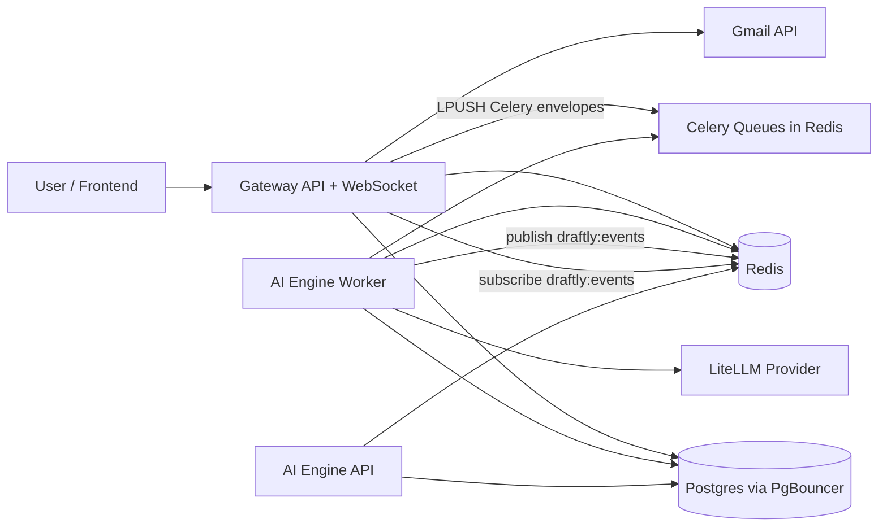
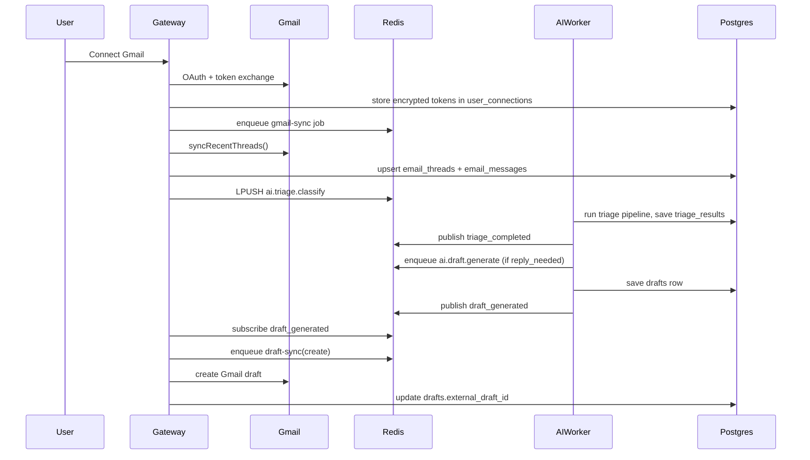

# Codebase Map and Flows

This is the functional map from feature -> service -> file.

---

## 1) High-Level Architecture

---

## 2) Service Entry Points

### Gateway (`gateway/src`)

- `index.ts`: process startup sequence
  - load env config
  - initialize DB + Redis + encryption
  - create Express app
  - initialize WebSocket
  - start Redis event subscriber
  - start BullMQ workers (`gmail-sync`, `send-reply`, `draft-sync`)

- `infrastructure/http/app.ts`: middleware + route registration
  - `/api/v1/admin` -> health
  - `/api/v1/auth` -> auth flows
  - `/api/v1/connections` -> connector + thread + draft APIs

### AI Engine (`ai-engine/src`)

- `main.py`: FastAPI app exposing `/health` and `/ping`
- `celery_app.py`: Celery config, queue routing:
  - `ai.triage.*` -> `triage-queue`
  - `ai.draft.*` -> `draft-queue`
  - `ai.profile.*` -> `profile-queue`

---

## 3) Feature to File Mapping

### Auth and Session

- `gateway/src/infrastructure/http/routes/auth.ts`
- `gateway/src/domain/auth/token.service.ts`
- `gateway/src/infrastructure/auth/google-strategy.ts`

Responsibilities:

- Google OAuth login
- local register/login for testing
- access/refresh token issue + refresh token rotation in Redis

### Gmail Connector and Sync

- `gateway/src/infrastructure/http/routes/connections.ts`
- `gateway/src/domain/connectors/gmail.adapter.ts`
- `gateway/src/infrastructure/workers/gmail-sync.worker.ts`
- `gateway/src/domain/connectors/connection.repository.ts`
- `gateway/src/domain/connectors/email.repository.ts`

Responsibilities:

- initiate OAuth connect flow
- store encrypted Gmail tokens
- sync Gmail threads/messages to DB
- dispatch AI triage/profile tasks

### AI Pipelines

- `ai-engine/src/tasks/triage_tasks.py`
- `ai-engine/src/tasks/draft_tasks.py`
- `ai-engine/src/tasks/profile_tasks.py`
- `ai-engine/src/pipelines/triage_pipeline.py`
- `ai-engine/src/pipelines/draft_pipeline.py`
- `ai-engine/src/pipelines/profile_pipeline.py`
- `ai-engine/src/infrastructure/llm/*`

Responsibilities:

- classify threads (heuristic + LLM)
- generate drafts from thread history + user profile
- build/update communication profile from sent messages

### Event Bridge (AI -> Gateway)

- `ai-engine/src/infrastructure/redis/event_publisher.py`
- `gateway/src/infrastructure/redis/events.ts`

Responsibilities:

- AI worker publishes to Redis pub/sub channel `draftly:events`
- gateway subscriber pushes events over WebSocket and triggers draft Gmail sync

### Draft Lifecycle and Sending

- `gateway/src/infrastructure/workers/draft-sync.worker.ts`
- `gateway/src/infrastructure/workers/send-reply.worker.ts`
- `gateway/src/infrastructure/http/routes/connections.ts`

Responsibilities:

- create/update/delete Gmail drafts to mirror internal draft state
- approve -> enqueue send job -> mark sent + write `send_attempts`

---

## 4) End-to-End Flow: New Gmail Thread -> AI Draft

---

## 5) Runtime Data Paths

- **HTTP path:** frontend -> gateway routes -> repositories -> Postgres.
- **Job path (Gateway side):** route handler -> BullMQ queue -> worker -> Gmail/DB.
- **Job path (AI side):** gateway `CeleryBridge` -> Redis list queue -> Celery task -> pipeline -> DB.
- **Realtime path:** AI publishes Redis pub/sub event -> gateway subscriber -> WebSocket emit to user.

---

## 6) Where to Change Code for Common Features

- Add new API endpoint:
  - `gateway/src/infrastructure/http/routes/*.ts`
  - domain/repo files as needed
- Add new AI capability:
  - `ai-engine/src/pipelines/*`
  - corresponding `ai-engine/src/tasks/*`
  - `celery_app.py` task route if new queue needed
- Add new async job in gateway:
  - `gateway/src/infrastructure/workers/*.ts`
  - enqueue from route/service
- Add new event type from AI to frontend:
  - publish in `ai-engine/src/infrastructure/redis/event_publisher.py`
  - handle in `gateway/src/infrastructure/redis/events.ts`
