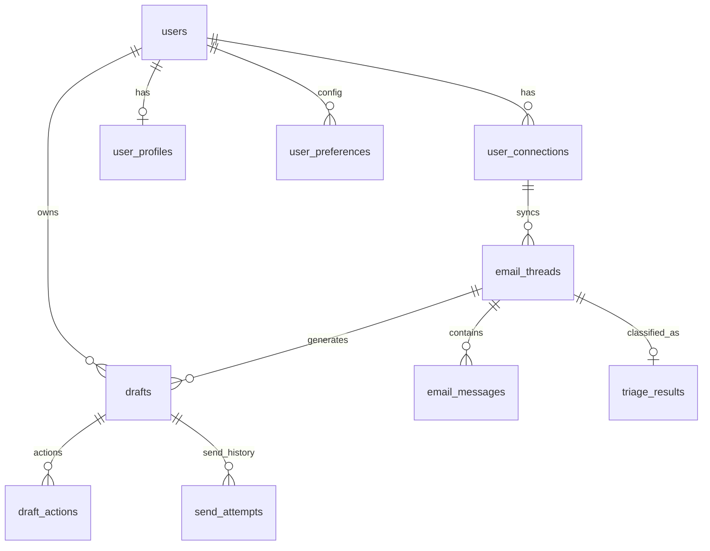

# Database Scripts and Schema Walkthrough

All schema changes are managed through Knex migrations in:

- `gateway/src/infrastructure/database/migrations`

Run:

- `npm run migrate` (from `gateway`)
- `npm run migrate:rollback` (from `gateway`)

---

## 1) Migration Order and Purpose

### `001_create_users.ts`

- Creates `users`
- Includes local auth fields (`password_hash`) and OAuth fields (`google_sub`)

### `002_create_user_connections.ts`

- Creates `user_connections`
- Stores encrypted connector tokens and sync status metadata

### `003_create_user_profiles.ts`

- Creates `user_profiles`
- Persona fields used by AI draft/profile pipelines

### `004_create_user_preferences.ts`

- Creates `user_preferences`
- Generic key-value JSONB preferences per user (`unique(user_id, key)`)

### `005_create_email_threads.ts`

- Creates `email_threads`
- One row per external provider thread id per connection

### `006_create_email_messages.ts`

- Creates `email_messages`
- Stores normalized message content + metadata per thread

### `007_create_triage_results.ts`

- Creates `triage_results`
- One triage result per thread (`thread_id` unique)

### `008_create_drafts.ts`

- Creates `drafts`
- Draft state machine records (`generated`, `edited`, `approved`, `sent`, `rejected`)

### `009_create_draft_actions.ts`

- Creates `draft_actions`
- Audit trail of user actions on drafts (`edit`, `approve`, `reject`)

### `010_create_send_attempts.ts`

- Creates `send_attempts`
- Tracks each send attempt including failures, external message id, timing

### `011_create_usage_records.ts`

- Creates partitioned `usage_records` (monthly partitions)
- Tracks usage, cost estimation, and correlation metadata

### `012_create_audit_logs.ts`

- Creates partitioned `audit_logs` (monthly partitions)
- Audit trail by entity/action with correlation ids

### `013_create_prompt_templates.ts`

- Creates `prompt_templates`
- Prompt versions/source-of-truth for AI templates (`triage_v1`, `draft_v1`, etc.)

### `014_add_external_draft_id.ts`

- Adds `drafts.external_draft_id`
- Enables update/delete/send operations on Gmail-side draft resource

---

## 2) Core Relational Graph



---

## 3) DB Access Paths in Code

### Gateway (Knex)

- DB bootstrap: `gateway/src/infrastructure/database/connection.ts`
- migration config: `gateway/src/infrastructure/database/knexfile.ts`
- repositories:
  - `domain/users/repository.ts`
  - `domain/connectors/connection.repository.ts`
  - `domain/connectors/email.repository.ts`

### AI Engine (SQLAlchemy async)

- engine/session factory: `ai-engine/src/config/database.py`
- ORM models: `ai-engine/src/infrastructure/database/models.py`
- pipelines read/write via session factory

Note: both services write to the same logical schema, but use different data access layers.

---

## 4) Why PgBouncer and Direct PG Both Exist

- Runtime app traffic in gateway is configured for PgBouncer (`DB_PORT=6432`) for connection pooling.
- Migration scripts force direct Postgres (`5432`) because DDL operations and partition creation should bypass transaction-pool behavior.
- AI engine workers are configured for direct Postgres async connections (`5432`) due to long-lived async workload characteristics.

---

## 5) Useful Verification Queries

Use these against Postgres to verify critical flow:

```sql
-- Latest synced threads
select id, connection_id, subject, last_message_at
from email_threads
order by last_message_at desc
limit 20;
```

```sql
-- Triage outcomes
select thread_id, classification, confidence, created_at
from triage_results
order by created_at desc
limit 20;
```

```sql
-- Draft lifecycle and Gmail mapping
select id, thread_id, status, version, external_draft_id, updated_at
from drafts
order by updated_at desc
limit 20;
```

```sql
-- Send reliability history
select draft_id, status, attempt_number, error_message, completed_at
from send_attempts
order by completed_at desc nulls last
limit 20;
```
