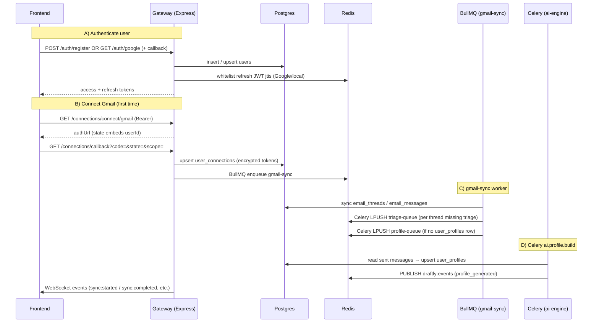

# Onboarding Flow Explained (Code Walkthrough)

This document traces **signup/register → Gmail connect (first sync) → user persona/profile build** across the Gateway, BullMQ worker, Celery AI worker, Postgres, Redis, and WebSockets.

---

## 1) End-to-end sequence



---

## 2) Phase A — Register / login (Google or local)

Routes live in `gateway/src/infrastructure/http/routes/auth.ts`.

### Local signup

1. **`POST /api/v1/auth/register`** validates email, name, password with Zod.
2. `UserRepository` checks for duplicate email then inserts into `users` with `auth_provider: 'local'` and a bcrypt hash.
3. `TokenService` issues:
   - an **RS256 access token** (short-lived).
   - a **refresh token** whose `jti` is stored in Redis under `draftly:refresh_tokens:{userId}:{jti}` so refresh can be rotated and revoked.

```116:151:gateway/src/infrastructure/http/routes/auth.ts
authRouter.post('/register', ipRateLimitMiddleware, async (req: Request, res: Response) => {
  const result = registerSchema.safeParse(req.body);
  if (!result.success) throw new ValidationError('Invalid registration input', result.error.format());

  const { email, name, password } = result.data;
  const db = getDatabase();
  const repo = new UserRepository(db);

  const existing = await repo.findByEmail(email);
  if (existing) {
    throw new ValidationError('Email already in use');
  }

  const salt = await bcrypt.genSalt(10);
  const passwordHash = await bcrypt.hash(password, salt);

  const user = await repo.create({
    email,
    name,
    passwordHash,
    authProvider: 'local',
    googleSub: null,
    role: 'user',
    isActive: true,
  });

  const accessToken = tokenService.generateAccessToken(user);
  const refreshToken = await tokenService.generateRefreshToken(user);

  res.status(201).json({
    message: 'Registration successful',
    user: { id: user.id, email: user.email, name: user.name },
    accessToken,
    refreshToken,
  });
});
```

### Google signup / login

1. **`GET /api/v1/auth/google`** starts Passport with scopes `profile` + `email`. Optional `redirect_uri` goes into OAuth state for SPA redirects after callback.
2. **`GET /api/v1/auth/google/callback`** runs `passport-google-oauth20`; the verified user is whichever `google-strategy.ts` resolves (new row, merge by email, or find by `google_sub`).
3. Same JWT issuance as local.

Passport verifier (user creation vs link-by-email):

```30:56:gateway/src/infrastructure/auth/google-strategy.ts
          // 1. Try to find user by google_sub
          let user = await repo.findByGoogleSub(profile.id);

          if (!user) {
            // 2. Try to find by email (if they registered locally first, or something)
            user = await repo.findByEmail(email);

            if (user) {
              // Upgrade their account with Google Sub
              await db('users').where({ id: user.id }).update({
                google_sub: profile.id,
                auth_provider: 'google', // Upgrade to google auth
              });
              user.googleSub = profile.id;
              user.authProvider = 'google';
            } else {
              // 3. New user registration automatically!
              user = await repo.create({
                email,
                name: profile.displayName,
                passwordHash: null,
                authProvider: 'google',
                googleSub: profile.id,
                role: 'user',
                isActive: true,
              });
              logger.info({ userId: user.id }, 'New user registered via Google OAuth');
            }
          }
```

### Subsequent API calls

`requireAuth` reads `Authorization: Bearer <access>` and attaches `req.user`:

```12:31:gateway/src/infrastructure/http/middleware/auth.ts
export function requireAuth(req: Request, _res: Response, next: NextFunction): void {
  const authHeader = req.headers.authorization;

  if (!authHeader || !authHeader.startsWith('Bearer ')) {
    throw new AuthenticationError('Missing or invalid Authorization header');
  }

  const token = authHeader.split(' ')[1];

  try {
    const payload = tokenService.verifyToken(token, 'access');
    // Attach user context to request
    (req as any).user = { id: payload.sub, email: payload.email, role: payload.role };
    // Maintain for request logger compat
    (req as any).userId = payload.sub;
    next();
  } catch (err) {
    // Propagate the specific AuthenticationError (expired, invalid signature, etc.)
    next(err);
  }
}
```

---

## 3) Phase B — Gmail connect (first time)

### Start OAuth (`/connections/connect/:type`)

Authenticated users receive a Gmail `authUrl`. `state` carries `userId` and connector type because the **callback is not Bearer-authenticated** (browser redirect from Google).

```56:82:gateway/src/infrastructure/http/routes/connections.ts
connectionsRouter.get('/connect/:type', requireAuth, userRateLimitMiddleware, async (req: Request, res: Response) => {
  const type = req.params.type as string;
  const userId = (req as any).user.id;
  // Optional redirect_uri from frontend — will be included in state and honoured in /callback
  const redirectUri = req.query.redirect_uri as string | undefined;

  const connector = connectorRegistry.get(type);
  if (!connector) {
    throw new NotFoundError('Connector', type);
  }

  if (type === 'gmail') {
    const oauth2Client = new google.auth.OAuth2(
      config.GOOGLE_CLIENT_ID,
      config.GOOGLE_CLIENT_SECRET,
      config.GMAIL_CALLBACK_URL,
    );

    const authUrl = oauth2Client.generateAuthUrl({
      access_type: 'offline',
      prompt: 'consent',
      scope: connector.scopes,
      state: JSON.stringify({ userId, connectorType: type, redirectUri: redirectUri || null }),
      include_granted_scopes: true,
    });

    res.json({ authUrl });
  } else {
    throw new ValidationError(`Connector '${type}' does not support OAuth yet`);
  }
});
```

### Callback (`/connections/callback`)

1. Validates `scope` against required Gmail scopes from the connector registry.
2. Exchanges `code` for tokens; encrypts access/refresh with `EncryptionService`.
3. `ConnectionRepository.upsert` persists `user_connections`.
4. **Immediately enqueues initial sync**: `enqueueGmailSync(...)`.

```218:225:gateway/src/infrastructure/http/routes/connections.ts
    // Trigger initial sync
    const correlationId = (req as any).correlationId || 'manual';
    await enqueueGmailSync({
      connectionId: connection.id,
      userId,
      correlationId,
      maxResults: 20,
    });
```

This is why “first Gmail connect” always kicks off ingestion without another user action.

---

## 4) Phase C — `gmail-sync` BullMQ worker (Gateway process)

Important: **`gmail-sync` is BullMQ**, not Celery. It uses Redis with BullMQ’s semantics. The Celery AI engine is invoked **later** via `CeleryBridge`.

Worker startup is wired from `gateway/src/index.ts` (`startGmailSyncWorker`). The handler:

1. Decrypts tokens, builds `GmailAdapter`.
2. Calls **`syncRecentThreads`** → writes `email_threads` + `email_messages`.
3. For each thread **without** a `triage_results` row → **`dispatchTriageTask`** (Redis list `triage-queue`, Celery message envelope).
4. If **no** `user_profiles` row exists for the user → **`dispatchProfileBuildTask`** (`profile-queue`).

```102:139:gateway/src/infrastructure/workers/gmail-sync.worker.ts
      // 3. Sync threads
      const result = await adapter.syncRecentThreads(maxResults || 20);

      // 4. Update sync status
      await connectionRepo.updateSyncStatus(connectionId, 'success', null);
      log.info({ synced: result.synced, messages: result.messages }, 'Gmail sync completed');

      // 5. Dispatch triage tasks to the Python AI Engine via CeleryBridge
      // Fetch all synced threads for this connection that don't have triage results yet
      const threads = await emailRepo.findThreadsByConnection(connectionId, maxResults || 20);
      const redis = getRedis();
      const celeryBridge = new CeleryBridge(redis);

      for (const thread of threads) {
        // Check if triage result already exists
        const triageExists = await db('triage_results')
          .where({ thread_id: thread.id })
          .first();

        if (!triageExists) {
          await celeryBridge.dispatchTriageTask({
            threadId: thread.id,
            userId,
            correlationId,
          });
          log.info({ threadId: thread.id }, 'Dispatched triage task to AI Engine');
        }
      }

      // 6. Check if user has a profile; if not, bootstrap one
      const profileExists = await db('user_profiles').where({ user_id: userId }).first();
      if (!profileExists) {
        await celeryBridge.dispatchProfileBuildTask({
          userId,
          correlationId,
        });
        log.info('Dispatched profile build task (first-time persona bootstrap)');
      }
```

Live progress: the worker emits WebSocket payloads such as **`sync:started`** / **`sync:completed`** (see same file).

---

## 5) Phase D — Profile / persona pipeline (AI Engine, Celery)

### Task registration

`ai-engine/src/celery_app.py` routes `ai.profile.*` to `profile-queue`. The onboarding task implemented today is **`ai.profile.build`** only.

### Task wrapper

```44:69:ai-engine/src/tasks/profile_tasks.py
@celery_app.task(
    name="ai.profile.build",
    queue="profile-queue",
    bind=True,
    max_retries=2,
    default_retry_delay=60,
    time_limit=240,
    soft_time_limit=180,
)
def build_profile_task(self, user_id: str) -> dict:
    """Build or update a user's communication profile based on their sent emails."""
    logger.info(
        "profile.task.started",
        user_id=user_id,
        task_id=self.request.id,
    )

    try:
        reset_engine()  # Fresh engine for this event loop (asyncio.run creates a new one)
        reset_redis()   # Fresh Redis client for this event loop
        result = asyncio.run(async_build_profile(user_id))
        logger.info("profile.task.completed", user_id=user_id, result=result)
        return result
    except Exception as exc:
        logger.error("profile.task.failed", user_id=user_id, error=str(exc))
        raise self.retry(exc=exc)
```

### Pipeline behavior (conceptual)

`create_profile_pipeline()` in `ai-engine/src/pipelines/profile_pipeline.py`:

- Loads recent **sent** messages for the user (join `user_connections` → `email_threads` → `email_messages` where `is_sent_by_user`).
- If there is insufficient text, the pipeline exits early (**no persona** until the user has outbound mail in the synced history).
- Otherwise an LLM produces structured persona fields (`greeting_style`, `preferred_tone`, etc.) and **`SaveProfileStage` upserts `user_profiles`**.

After success, **`profile_generated`** is published on Redis Pub/Sub `draftly:events`; the Gateway subscriber can fan that out over WebSockets (same channel as triage/draft events).

Gateway bridge note: `CeleryBridge.dispatchProfileUpdateTask` mentions `ai.profile.update`, but **there is no matching `@celery_app.task` in `ai-engine` today**, so incremental “update persona after each draft” is not wired unless you add that task.

---

## 6) Onboarding troubleshooting (quick map)

| Symptom | Where to look |
|--------|----------------|
| Cannot call `/connections/*` | `requireAuth` / token expiry |
| Callback fails “missing scopes” | `connections.ts` scope verification vs Google console scopes |
| No threads in DB | `GmailAdapter.syncRecentThreads`; worker logs |
| Triage never runs | Celery worker not consuming `triage-queue`; Redis URL mismatch |
| Persona never created | No sent messages synced yet; profile pipeline exits early |
| Profile task never dispatched | Row already exists in `user_profiles` (bootstrap only runs when missing) |

For deeper operational tips, see [04-debugging-playbook.md](./04-debugging-playbook.md).
