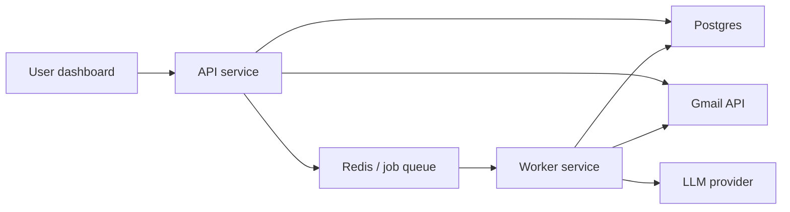
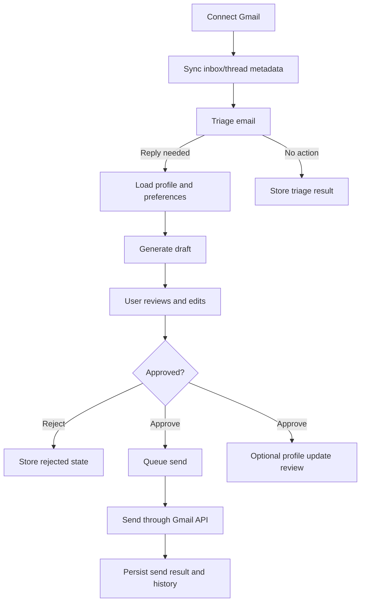
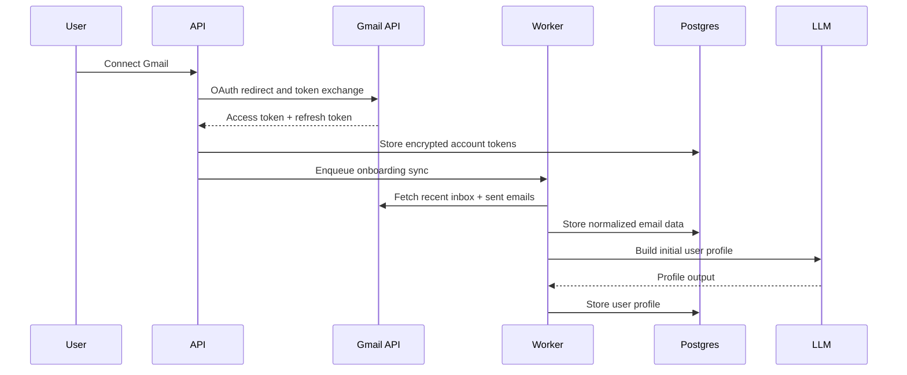
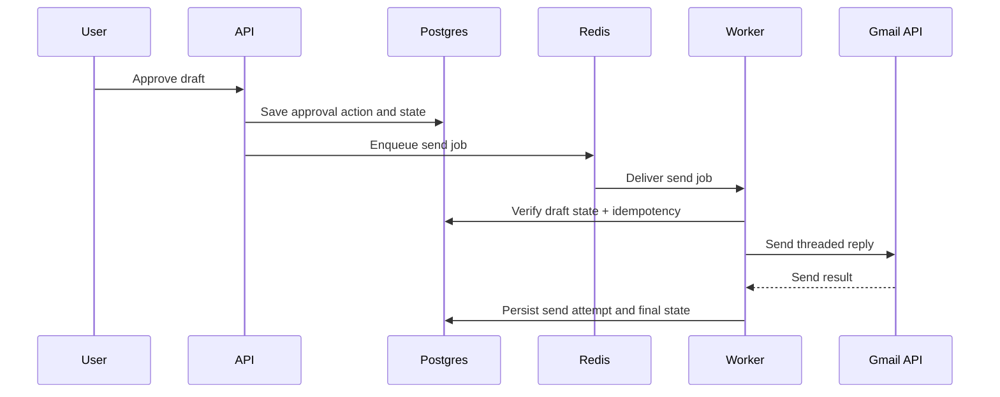
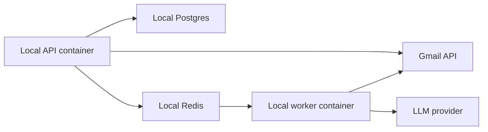

# Draftly Core Solution Design - 100 Users

## Objective

Define the reference implementation for Draftly at the 100-user scale. This is the version we should actually build first. It must satisfy the frozen capstone scope, remain locally runnable, and preserve the same product workflow and domain model that later scale tiers will reuse.

## Design Principles

- correctness over cleverness
- approval-first workflow
- async where it improves safety or user experience
- simple enough to implement fully
- structured enough to scale without redesigning core entities
- Gmail as external source of truth for mail delivery

## System Goals at 100 Users

- support up to roughly 100 active users with low to moderate concurrent activity
- handle Gmail sync, draft generation, and send operations safely
- keep infrastructure minimal and affordable
- make failure handling and idempotency explicit
- provide a strong capstone demo and technical story

## Scope Covered by This Design

This design implements the capstone baseline:

- Gmail OAuth connection
- inbox/thread ingestion
- metadata and raw header snapshot storage
- email triage
- contextual draft generation
- user preference and signature application
- optional profile-first personalization
- review, edit, approve, reject workflow
- approved-only threaded send
- retries, audit logs, and history
- quota-aware and idempotent Gmail interaction

## Proposed Architecture

At 100 users, the best design is a modular monolith with async workers.

### Runtime Components

- `api-service`: REST API handling auth, UI actions, read models, and orchestration entrypoints
- `worker-service`: background jobs for sync, classification, draft generation, profile updates, retries, and send
- `postgres`: primary system-of-record database
- `redis`: queue broker, job coordination, short-lived cache, and dedup support
- `gmail-api`: external email source and send channel
- `llm-provider`: external model for triage, drafting, and optional profile updates

## Why This Shape Is Right

This is intentionally not a microservices design.

At 100 users:

- one API service keeps the implementation understandable
- one worker tier is enough for async isolation
- Postgres gives transactional workflow correctness
- Redis gives cheap background execution and dedup control
- the architecture remains production-shaped without needless operational complexity

This gives us the right tradeoff:

- better than an all-sync single process
- simpler than distributed event-heavy services

## Core Domain Responsibilities

### API Service

The API service is responsible for:

- user login/session handling
- Gmail OAuth connect and reconnect flow
- inbox/thread list APIs
- draft review and edit APIs
- approve, reject, regenerate, and send initiation
- reading state from Postgres
- writing user-triggered workflow transitions
- enqueueing background jobs

### Worker Service

The worker service is responsible for:

- inbox sync jobs
- thread fetch and normalization
- email triage/classification
- draft generation
- user profile bootstrap or refresh
- post-approval profile update review
- send execution
- retry and backoff logic
- token refresh handling during background operations

### Postgres

Postgres is the source of truth for:

- users
- Gmail account linkage
- threads and messages
- draft state
- approval actions
- send attempts
- user preferences and user profile
- audit logs
- job/event records where persistence is required

### Redis

Redis is used for:

- background job queueing
- short-lived idempotency coordination
- duplicate event suppression
- transient caching where useful

## High-Level Workflow

## Detailed Workflows

### 1. Gmail Onboarding Flow

Purpose:
- connect the user account securely
- fetch enough mailbox context to start the system
- bootstrap personalization

Steps:

1. User starts Gmail connect flow.
2. API redirects to Google OAuth consent.
3. Google returns auth code.
4. API exchanges code for access and refresh tokens.
5. Tokens and user preferences are encrypted before storage.
6. API creates the Gmail account linkage record.
7. API enqueues onboarding sync.
8. Worker fetches recent inbox metadata and a bounded set of recent sent emails.
9. Worker stores normalized messages and metadata snapshot.
10. Worker builds an initial user profile from recent sent emails and explicit preferences.

### 2. Inbox Sync Flow

Purpose:
- keep local workflow state aligned with Gmail
- feed triage and draft generation

100-user recommendation:
- support scheduled polling first
- keep Gmail push/watch as optional enhancement if time allows

Polling is acceptable at 100 users because:

- the user count is small
- the operational burden is lower
- it is easier to reason about locally
- it is enough for capstone if documented clearly

Sync steps:

1. Worker pulls recent relevant inbox messages for each connected account.
2. Worker deduplicates based on Gmail message/thread identifiers.
3. Worker stores normalized message content and raw headers.
4. Worker queues triage for newly relevant items.

### 3. Triage Flow

Purpose:
- prevent unnecessary drafts
- reduce LLM cost
- improve user trust

Decision categories in v1:

- `reply_needed`
- `informational_no_action`
- `notification_or_subscription`
- `cc_or_bulk_low_priority`

Recommended implementation:

- first apply cheap heuristics
- only use the LLM when the heuristic result is uncertain

Suggested heuristics:

- user in `To` and message contains a direct question -> likely `reply_needed`
- sender or headers indicate automated notification -> likely `notification_or_subscription`
- user only in `Cc` -> likely `cc_or_bulk_low_priority`
- no clear call to action -> likely `informational_no_action`

Why hybrid triage is better:

- lower cost
- lower latency
- more predictable behavior

### 4. Draft Generation Flow

Purpose:
- create a high-context reply draft with strong tone consistency

Inputs:

- current thread messages
- sender and subject metadata
- user profile
- explicit user preferences
- signature template
- recent sent-email examples only when profile refresh or fallback grounding is needed

Draft generation steps:

1. Worker loads the thread context snapshot.
2. Worker loads the user profile and explicit preferences.
3. Worker optionally loads sampled sent-email examples if profile confidence is low.
4. Worker prompts the LLM with a structured instruction set.
5. Worker stores generated draft text, model metadata, and generation status.
6. API exposes the draft for user review.

Prompting guidance for implementation:

- keep prompt sections explicit
- separate thread facts from style instructions
- include constraints such as no hallucinated commitments
- include approval-first wording so the system drafts, not acts

### 5. Review and Approval Flow

Purpose:
- keep the user in control
- enforce capstone workflow correctness

User actions:

- view draft
- edit draft
- approve draft
- reject draft
- optionally request re-generation

Workflow states:

- `triaged`
- `draft_pending`
- `draft_ready`
- `draft_edited`
- `approved`
- `rejected`
- `send_queued`
- `sent`
- `send_failed`

Important rule:

- `approved` is required before send can be queued

### 6. Send Flow

Purpose:
- send exactly one intended reply into the correct Gmail thread

Send safety requirements:

- idempotency key per send attempt
- lock or transactional check before dispatch
- thread/message metadata included correctly
- retry only for transient failures

Send steps:

1. API receives approve action.
2. API stores approval action transactionally.
3. API enqueues send job.
4. Worker checks draft state is still valid.
5. Worker checks idempotency key has not already succeeded.
6. Worker sends the reply via Gmail API with required thread context.
7. Worker persists outcome and send metadata.
8. Worker marks final state as `sent` or `send_failed`.

### 7. User Profile and Personalization Flow

Purpose:
- reduce repetitive prompt cost
- keep tone consistent across emails
- satisfy the case-study personalization requirement

100-user recommendation:
- profile-first personalization
- recent sent emails for onboarding and recalibration

Profile contents should be bounded and structured:

- greeting style
- closing style
- signature template
- preferred tone
- communication norms
- lightweight current priorities if clearly inferable

Update strategy:

1. Worker considers profile update only after approved replies.
2. LLM returns `no_change` or a structured patch.
3. System applies only bounded changes.
4. Profile version is incremented for traceability.

This reduces cost because:

- every draft does not require multiple full sent-email examples
- most generations use a compact structured profile instead

## Data Ownership at 100 Users

The 100-user system should still separate data by responsibility even inside one codebase.

### Operational Data

- user account linkage
- tokens
- preferences
- thread/message metadata
- drafts
- send attempts
- actions

### Derived Data

- triage outcome
- user profile
- thread summary
- LLM generation metadata

### Audit Data

- approval/reject/edit actions
- send history
- retry history
- token refresh failures
- sync failures

## Reliability Model

The system is CP-leaning on critical workflow writes.

What we protect strongly:

- approval state transitions
- send idempotency
- final send outcome recording
- token update correctness

What can be eventually consistent:

- dashboard refresh views
- summaries
- profile refresh timing
- historical aggregates

## Failure Handling Strategy

### Gmail Failures

Potential issues:

- expired tokens
- temporary API failure
- quota/backoff response
- malformed thread metadata

Handling:

- refresh token when possible
- retry transient failures with exponential backoff
- surface reconnect requirement when refresh fails
- mark non-recoverable failures explicitly

### LLM Failures

Potential issues:

- timeout
- invalid structured response
- provider outage

Handling:

- retry limited transient errors
- fail draft generation gracefully
- mark thread for manual retry
- never block inbox storage because draft generation failed

### Database / Queue Failures

Handling:

- transactional writes for critical workflow transitions
- retry queue job when safe
- ensure send jobs remain idempotent after redelivery

## Security Design

At capstone scale, these are the minimum serious controls:

- OAuth2 for Gmail access
- encrypted storage for access tokens, refresh tokens, and user preferences
- authenticated API access for the product itself
- separation between public API and worker credentials
- no plaintext secrets in code or logs
- careful redaction of sensitive email content in logs

## Quota and Cost Control

Gmail quota and LLM cost are important even at 100 users.

### Gmail Cost Controls

- sync only relevant recent windows
- deduplicate aggressively
- back off on quota pressure
- avoid repeated thread fetches when data is fresh enough

### LLM Cost Controls

- triage with heuristics before LLM fallback
- use profile-first personalization
- sample sent emails only during onboarding or recalibration
- keep prompts structured and bounded
- summarize long threads before drafting if needed

## Local Deployment Design

This 100-user system should run locally using containers or local processes.

Recommended local setup:

- `api-service`
- `worker-service`
- `postgres`
- `redis`

Optional:

- local frontend dashboard later

Why this matters:

- easy demo
- easy debugging
- realistic enough for resume value
- minimal infra burden during development

## Concurrency Model at 100 Users

Concurrency is moderate, not extreme.

Expected concurrent patterns:

- multiple users polling inboxes
- several draft generation jobs in flight
- occasional simultaneous approve/send operations

Protection mechanisms:

- async queues for slow work
- DB transaction boundaries for state transitions
- idempotency keys for send attempts
- optimistic version checks for drafts where needed
- duplicate sync suppression using Gmail identifiers

## Observability

Even the 100-user version should expose useful signals.

Minimum observability:

- request logs
- worker job logs
- sync success/failure counters
- draft generation success/failure counters
- send success/failure counters
- token refresh failure count
- queue backlog visibility

## Tradeoffs and Intentional Non-Decisions

Intentional choices:

- modular monolith instead of microservices
- polling-first sync instead of mandatory push-watch
- profile-first personalization instead of always sending recent emails
- dashboard-first UI instead of Gmail-native UI

Intentionally deferred:

- Calendar/Meet workflows
- Drive access workflows
- team approvals
- multi-channel adapters
- full production cloud topology

## How This Design Extends Cleanly Later

This 100-user design should scale by decomposition, not reinvention.

What remains stable later:

- workflow states
- core entities
- API contracts
- personalization model
- triage model

What will change at 1000 users:

- service separation becomes stronger
- sync and send workers split
- queue isolation improves
- observability deepens
- deployment becomes cloud-ready

## Build Order Recommendation

The implementation order for this design should be:

1. OAuth and Gmail account linkage
2. inbox/thread ingestion and storage
3. triage pipeline
4. draft generation pipeline
5. review/edit/approve/reject flow
6. send flow with idempotency
7. profile bootstrap and profile update
8. retry, observability, and polish

## Output of This Document

This document should serve as the reference for:

- unified schema design
- unified API design
- 1000-user HLD delta
- 10k-100k system design evolution

---

## Addendum: Decided Implementation Supersessions

*This 100-user document was the starting design reference. The implementation builds for 1000 users directly. Below are the specific points where the 100-user design is superseded.*

### 1. "Modular monolith with async workers" (line 42) → Superseded

**What we build:** Dual-service architecture — Node.js Gateway + Python AI Engine. The monolith was appropriate for 100 users. At 1000 users with ~300 concurrency and a product-grade extensibility requirement, the split is justified. The domain model, entities, and workflow states from this document are preserved exactly.

### 2. "`api-service` + `worker-service`" (line 46-47) → Superseded

**What we build:** Four service components:
- `gateway` — Node.js (Express): REST API, OAuth, WebSocket, Gmail I/O workers (BullMQ)
- `ai-engine-worker` — Python (Celery): triage, draft generation, profile update workers
- `ai-engine-api` — Python (FastAPI): health/admin endpoints only
- `celery-beat` — Python: scheduled task scheduler

### 3. "Polling-first sync, push-watch as optional enhancement" (line 203-204) → Kept

**What we build:** Polling-first, as recommended. Scheduled sync every 5 minutes via BullMQ repeatable job. Manual sync trigger via API. Gmail push/watch deferred. This document's reasoning is correct — polling is acceptable and operationally simpler at 1000 users.

### 4. "One worker tier is enough" (line 72) → Superseded

**What we build:** Isolated worker pools per concern:
- `gmail-sync-queue` (Node BullMQ, concurrency: 10)
- `gmail-send-queue` (Node BullMQ, concurrency: 5)
- `triage-queue` (Python Celery, concurrency: 15)
- `draft-queue` (Python Celery, concurrency: 8)
- `profile-queue` (Python Celery, concurrency: 3)

Draft generation (slow, LLM-bound) cannot share a worker pool with send dispatch (fast, latency-critical). This document correctly anticipated this at "What will change at 1000 users" (line 596-602).

### 5. "LLM cost controls — triage with heuristics before LLM fallback" (line 497) → Kept and expanded

**What we build:** Hybrid triage exactly as described — heuristic rules first, LLM only when confidence < 0.8. Additionally: LLM token budgets per user (50k/hour, 200k/day), usage tracking with cost estimation per request, and circuit breaker for LLM provider failures.

### 6. "Local deployment design" (line 503-512) → Kept and expanded

**What we build:** Docker Compose with all services. Same spirit (locally runnable, easy debugging) but with 7 containers instead of 4: gateway, ai-engine-worker, ai-engine-api, celery-beat, postgres, pgbouncer, redis.

### 7. Build order (line 607-615) → Modified

**What we build:** Same logical order with additional foundational steps:
1. Project scaffolding (both services) + Docker Compose + migrations
2. Auth (Google OAuth + JWT + traditional fallback)
3. Gmail OAuth connector + token encryption + sync worker
4. Triage pipeline (heuristic + LLM hybrid, Python)
5. Draft generation pipeline (Python)
6. Review/edit/approve/reject flow (Node + optimistic locking)
7. Send flow with idempotency (Node)
8. Profile bootstrap and update (Python)
9. Usage tracking + observability + hardening

### What remains unchanged from this document

Everything in the domain model, workflow states, data ownership, reliability model, failure handling strategy, security design, and quota controls is implemented exactly as described. The 100-user design got the hard parts right — domain correctness, approval-first workflow, idempotent sends, and separation of operational vs derived vs audit data.
