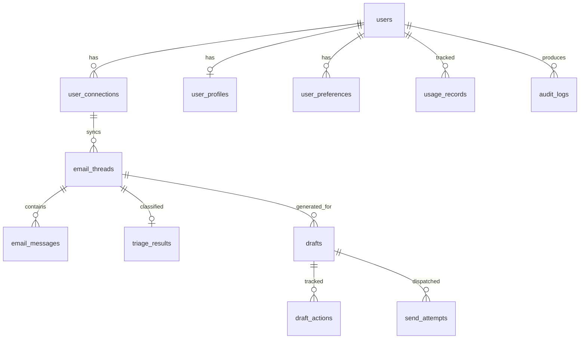

# Database Design — Detailed Design

## Design Decisions

| Decision | Choice | Why | What Could Go Wrong |
|----------|--------|-----|---------------------|
| PostgreSQL 16 | Relational DB | Workflow state is inherently relational (threads→messages→drafts→sends). ACID transactions protect critical paths (approve+send). jsonb gives NoSQL flexibility where needed. | If we ever need real-time search across email bodies, Postgres full-text search has limits. Would add Elasticsearch/Meilisearch then. |
| UUID v7 primary keys | Time-sortable UUIDs | No auto-increment sequence contention (matters at scale). Globally unique (safe for future sharding). Time-sorted (natural ordering without extra index). | UUIDs are 16 bytes vs 8 bytes for BIGINT. Larger indexes. At 1000 users, this is negligible. |
| PgBouncer (transaction mode) | Connection pooler | 300 concurrent app connections → ~40 actual PG connections. PostgreSQL fork-per-connection model fails at 300+ (memory, context switching). Transaction mode returns connections to pool after each transaction. | Can't use LISTEN/NOTIFY (we use Redis pub/sub instead). Can't use prepared statements across transactions (Knex/SQLAlchemy don't rely on this). |
| App-level encryption (AES-256-GCM) | Token storage | DB compromise alone doesn't expose tokens. Encryption key lives in app environment, not in DB. GCM mode provides tamper detection (authentication tag). | If encryption key is lost, all tokens are unrecoverable. Must back up the key separately. Key rotation requires re-encrypting all tokens. |
| `jsonb` for flexible fields | raw_headers, participants, metadata | Always read/written as a unit. Queryable with GIN indexes if needed. Avoids over-normalization. | No schema enforcement at DB level — app must validate. Can grow unbounded if not careful (raw_headers capped at ingestion). |
| Partitioning on time-series tables | usage_records, audit_logs | These tables grow linearly. Monthly partitions enable efficient pruning (`DROP PARTITION` vs `DELETE`), faster range queries. | Partition management overhead. Use pg_partman for automatic partition creation. |

---

## Entity-Relationship Diagram



---

## Table Definitions

### users

| Column | Type | Constraints | Notes |
|--------|------|-------------|-------|
| id | uuid (v7) | PK | |
| email | varchar(255) | UNIQUE, NOT NULL | Canonical email from Google or registration |
| name | varchar(255) | NOT NULL | |
| password_hash | varchar(255) | NULLABLE | NULL for OAuth-only users |
| auth_provider | varchar(20) | NOT NULL, DEFAULT 'local' | 'google' or 'local' |
| google_sub | varchar(255) | UNIQUE, NULLABLE | Google subject ID for OAuth users |
| role | varchar(20) | NOT NULL, DEFAULT 'user' | 'user' or 'admin' |
| is_active | boolean | NOT NULL, DEFAULT true | Soft delete |
| created_at | timestamptz | NOT NULL, DEFAULT NOW() | |
| updated_at | timestamptz | NOT NULL, DEFAULT NOW() | |

### user_connections

| Column | Type | Constraints | Notes |
|--------|------|-------------|-------|
| id | uuid (v7) | PK | |
| user_id | uuid | FK → users, NOT NULL | |
| connector_type | varchar(50) | NOT NULL | 'gmail', 'google-calendar', 'jira' |
| encrypted_access_token | bytea | NOT NULL | AES-256-GCM encrypted |
| encrypted_refresh_token | bytea | NOT NULL | AES-256-GCM encrypted |
| token_expires_at | timestamptz | NOT NULL | |
| status | varchar(20) | NOT NULL, DEFAULT 'active' | 'active', 'expired', 'revoked', 'error' |
| connector_metadata | jsonb | | Scopes granted, account email, etc. |
| last_synced_at | timestamptz | | |
| last_sync_status | varchar(20) | | 'success', 'partial', 'failed' |
| last_sync_error | text | | |
| created_at | timestamptz | NOT NULL, DEFAULT NOW() | |
| updated_at | timestamptz | NOT NULL, DEFAULT NOW() | |

### user_profiles

| Column | Type | Constraints | Notes |
|--------|------|-------------|-------|
| id | uuid (v7) | PK | |
| user_id | uuid | FK → users, UNIQUE, NOT NULL | One profile per user |
| greeting_style | jsonb | | e.g., `{"formal": true, "common_phrases": ["Hello", "Hi"]}` |
| closing_style | jsonb | | e.g., `{"formal": true, "common_phrases": ["Best regards", "Thanks"]}` |
| signature_template | text | | Full signature block |
| personalized_profile | text | | AI-generated writing style description |
| preferred_tone | varchar(50) | | 'professional', 'friendly', 'concise', 'formal', 'casual' |
| communication_norms | jsonb | | Patterns observed from sent emails |
| current_priorities | jsonb | | Inferred from recent threads |
| profile_version | integer | NOT NULL, DEFAULT 1 | Incremented on update |
| confidence_score | decimal(3,2) | DEFAULT 0.0 | 0.0 to 1.0 |
| profile_source | varchar(20) | DEFAULT 'default' | 'default' or 'ai_generated' |
| last_calibrated_at | timestamptz | | Last time sent emails were analyzed |
| created_at | timestamptz | NOT NULL, DEFAULT NOW() | |
| updated_at | timestamptz | NOT NULL, DEFAULT NOW() | |

### user_preferences

| Column | Type | Constraints | Notes |
|--------|------|-------------|-------|
| id | uuid (v7) | PK | |
| user_id | uuid | FK → users, NOT NULL | |
| key | varchar(100) | NOT NULL | UNIQUE together with user_id |
| value | jsonb | NOT NULL | |
| updated_at | timestamptz | NOT NULL, DEFAULT NOW() | |

UNIQUE constraint: `(user_id, key)`

### email_threads

| Column | Type | Constraints | Notes |
|--------|------|-------------|-------|
| id | uuid (v7) | PK | |
| connection_id | uuid | FK → user_connections, NOT NULL | |
| external_thread_id | varchar(255) | NOT NULL | Gmail thread ID. UNIQUE with connection_id. |
| subject | text | | |
| participants | jsonb | | `[{"email": "...", "name": "..."}]` |
| message_count | integer | DEFAULT 0 | |
| last_message_at | timestamptz | | |
| sync_status | varchar(20) | DEFAULT 'synced' | 'synced', 'partial', 'error' |
| created_at | timestamptz | NOT NULL, DEFAULT NOW() | |
| updated_at | timestamptz | NOT NULL, DEFAULT NOW() | |

UNIQUE constraint: `(connection_id, external_thread_id)`

### email_messages

| Column | Type | Constraints | Notes |
|--------|------|-------------|-------|
| id | uuid (v7) | PK | |
| thread_id | uuid | FK → email_threads, NOT NULL | |
| external_message_id | varchar(255) | UNIQUE, NOT NULL | Gmail message ID. Dedup key. |
| from_address | varchar(255) | NOT NULL | |
| to_addresses | jsonb | NOT NULL | Array of addresses |
| cc_addresses | jsonb | | Array of addresses |
| subject | text | | |
| body_text | text | | Plain text body |
| body_html | text | | HTML body (for rendering) |
| raw_headers | jsonb | | Full headers for audit |
| received_at | timestamptz | NOT NULL | |
| is_sent_by_user | boolean | NOT NULL, DEFAULT false | |
| created_at | timestamptz | NOT NULL, DEFAULT NOW() | |

### triage_results

| Column | Type | Constraints | Notes |
|--------|------|-------------|-------|
| id | uuid (v7) | PK | |
| thread_id | uuid | FK → email_threads, UNIQUE, NOT NULL | One result per thread |
| classification | varchar(50) | NOT NULL | 'reply_needed', 'already_replied', 'promotions', 'info', 'junk' (configurable via triage_categories.json) |
| method | varchar(20) | NOT NULL | 'heuristic', 'llm', 'batch_llm' |
| confidence | decimal(3,2) | | 0.0 to 1.0 |
| reasoning | text | | LLM's explanation or heuristic rule matched |
| llm_metadata | jsonb | | model, tokens, cost — `{ "model": "...", "input_tokens": N, "output_tokens": N, "cost": 0.0 }` |
| created_at | timestamptz | NOT NULL, DEFAULT NOW() | |

### drafts

| Column | Type | Constraints | Notes |
|--------|------|-------------|-------|
| id | uuid (v7) | PK | |
| thread_id | uuid | FK → email_threads, NOT NULL | |
| user_id | uuid | FK → users, NOT NULL | |
| generated_content | text | | Original AI output (never modified) |
| current_content | text | | What the user sees/edits. Initially same as generated. |
| status | varchar(20) | NOT NULL | See state machine in system-design-overview |
| version | integer | NOT NULL, DEFAULT 1 | Optimistic concurrency control |
| generation_metadata | jsonb | | model, tokens, cost, prompt_hash |
| idempotency_key | varchar(255) | UNIQUE, NULLABLE | Generated on approval. Format: `send:{draftId}:v{version}` |
| external_draft_id | varchar(255) | NULLABLE | Gmail draft ID (for syncing draft to Gmail drafts folder) |
| created_at | timestamptz | NOT NULL, DEFAULT NOW() | |
| updated_at | timestamptz | NOT NULL, DEFAULT NOW() | |

**Valid statuses:** `pending`, `generated`, `edited`, `approved`, `rejected`, `sent`, `send_failed`

> **Note:** The implementation uses simpler status names than originally designed. `draft_pending` → `pending`, `draft_ready` → `generated`, `draft_edited` → `edited`.

### draft_actions

| Column | Type | Constraints | Notes |
|--------|------|-------------|-------|
| id | uuid (v7) | PK | |
| draft_id | uuid | FK → drafts, NOT NULL | |
| user_id | uuid | FK → users, NOT NULL | |
| action_type | varchar(20) | NOT NULL | 'view', 'edit', 'approve', 'reject', 'regenerate' |
| snapshot_before | text | | Content before action |
| snapshot_after | text | | Content after action (edits only) |
| metadata | jsonb | | Additional context |
| created_at | timestamptz | NOT NULL, DEFAULT NOW() | |

### send_attempts

| Column | Type | Constraints | Notes |
|--------|------|-------------|-------|
| id | uuid (v7) | PK | |
| draft_id | uuid | FK → drafts, NOT NULL | |
| idempotency_key | varchar(255) | UNIQUE, NOT NULL | Matches drafts.idempotency_key |
| status | varchar(20) | NOT NULL, DEFAULT 'pending' | 'pending', 'processing', 'sent', 'failed', 'cancelled' |
| external_message_id | varchar(255) | | Gmail message ID on success |
| error_message | text | | Error details on failure |
| attempt_number | integer | NOT NULL, DEFAULT 1 | |
| queued_at | timestamptz | NOT NULL | |
| started_at | timestamptz | | |
| completed_at | timestamptz | | |

### usage_records (partitioned)

| Column | Type | Constraints | Notes |
|--------|------|-------------|-------|
| id | uuid (v7) | PK | |
| user_id | uuid | FK → users, NOT NULL | |
| resource_type | varchar(50) | NOT NULL | 'llm_input_tokens', 'llm_output_tokens', 'gmail_api_call', 'draft_generated', 'email_sent' |
| resource_detail | varchar(200) | | Model name, endpoint, etc. |
| quantity | integer | NOT NULL | Token count, call count |
| estimated_cost_usd | decimal(10,6) | | Micro-precision for per-token costs |
| usage_date | date | NOT NULL, DEFAULT CURRENT_DATE | Partition key |
| correlation_id | varchar(100) | | Links to job that caused usage |
| metadata | jsonb | | |
| created_at | timestamptz | NOT NULL, DEFAULT NOW() | |

Partitioned by `RANGE (usage_date)`, monthly partitions.

### audit_logs (partitioned)

| Column | Type | Constraints | Notes |
|--------|------|-------------|-------|
| id | uuid (v7) | PK | |
| user_id | uuid | NOT NULL | Not FK — audit logs survive user deletion |
| entity_type | varchar(50) | NOT NULL | 'draft', 'connection', 'profile', 'user' |
| entity_id | uuid | NOT NULL | |
| action | varchar(50) | NOT NULL | 'created', 'updated', 'approved', 'sent', 'deleted' |
| changes | jsonb | | Before/after or relevant data |
| ip_address | varchar(45) | | IPv4 or IPv6 |
| correlation_id | varchar(100) | | Cross-service trace |
| created_at | timestamptz | NOT NULL, DEFAULT NOW() | |

Partitioned by `RANGE (created_at)`, monthly partitions.

### prompt_templates

| Column | Type | Constraints | Notes |
|--------|------|-------------|-------|
| id | uuid (v7) | PK | |
| name | varchar(100) | UNIQUE, NOT NULL | Template identifier (e.g., 'triage_v1', 'draft_v1') |
| description | text | | Human-readable description |
| system_prompt | text | NOT NULL | System prompt content |
| user_prompt_template | text | NOT NULL | User prompt template (may contain Jinja2 variables) |
| is_active | boolean | NOT NULL, DEFAULT true | Only active templates are served |
| created_at | timestamptz | NOT NULL, DEFAULT NOW() | |
| updated_at | timestamptz | NOT NULL, DEFAULT NOW() | |

Used by the AI Engine's `PromptManager` for versioned prompt management with Redis caching.

---

## Indexes

```sql
-- Auth lookups
CREATE UNIQUE INDEX idx_users_email ON users(email);
CREATE UNIQUE INDEX idx_users_google_sub ON users(google_sub) WHERE google_sub IS NOT NULL;

-- Connection management
CREATE INDEX idx_connections_user ON user_connections(user_id, status);
CREATE INDEX idx_connections_sync_due ON user_connections(last_synced_at)
    WHERE status = 'active';

-- Thread dedup and listing
CREATE UNIQUE INDEX idx_threads_external ON email_threads(connection_id, external_thread_id);
CREATE INDEX idx_threads_recent ON email_threads(connection_id, last_message_at DESC);

-- Message dedup
CREATE UNIQUE INDEX idx_messages_external ON email_messages(external_message_id);
CREATE INDEX idx_messages_thread ON email_messages(thread_id, received_at);

-- Triage (one per thread)
CREATE UNIQUE INDEX idx_triage_thread ON triage_results(thread_id);

-- Draft dashboard (most common query)
CREATE INDEX idx_drafts_user_active ON drafts(user_id, status)
    WHERE status NOT IN ('sent', 'rejected');
CREATE INDEX idx_drafts_thread ON drafts(thread_id);

-- Send safety
CREATE UNIQUE INDEX idx_send_idemp ON send_attempts(idempotency_key);

-- Preferences lookup
CREATE UNIQUE INDEX idx_prefs_user_key ON user_preferences(user_id, key);

-- Usage aggregation
CREATE INDEX idx_usage_user_date ON usage_records(user_id, usage_date);

-- Audit search
CREATE INDEX idx_audit_user ON audit_logs(user_id, created_at DESC);
CREATE INDEX idx_audit_correlation ON audit_logs(correlation_id)
    WHERE correlation_id IS NOT NULL;
```

---

## Connection Pooling

```
 Node Gateway (pool: 20 per instance × 2)    ──┐
                                                 ├──► PgBouncer ──► PostgreSQL
 Python AI Engine (pool: 15 per instance × 2) ──┘    (pool: 40)    (max_conn: 100)
```

| Setting | Value | Why |
|---------|-------|-----|
| PgBouncer `max_client_conn` | 200 | Total connections from all app instances |
| PgBouncer `default_pool_size` | 40 | Actual PG connections. Enough for our workload. |
| PgBouncer `pool_mode` | transaction | Returns connection to pool after each transaction. Best for short queries. |
| PgBouncer `reserve_pool_size` | 5 | Emergency overflow for traffic spikes |
| PostgreSQL `max_connections` | 100 | PgBouncer pool (40) + monitoring (5) + migrations (2) + buffer |
| Node Knex `pool.min` | 2 | Keep warm connections |
| Node Knex `pool.max` | 20 | Per instance |
| Python SQLAlchemy `pool_size` | 15 | Per worker process |
| Python SQLAlchemy `max_overflow` | 5 | Temporary extra connections |

---

## Migration Strategy

- Migrations are managed by **Knex.js** (Node.js Gateway) only — single source of truth.
- Python reads the schema created by Knex migrations. It does NOT run its own migrations.
- Migration files live in `gateway/src/infrastructure/database/migrations/`.
- Run migrations before starting either service: `cd gateway && npx knex migrate:latest`.
- All migrations are UP/DOWN reversible.

### Migration file order

```
001_create_users.ts
002_create_user_connections.ts
003_create_user_profiles.ts
004_create_user_preferences.ts
005_create_email_threads.ts
006_create_email_messages.ts
007_create_triage_results.ts
008_create_drafts.ts
009_create_draft_actions.ts
010_create_send_attempts.ts
011_create_usage_records.ts      (with partitioning)
012_create_audit_logs.ts         (with partitioning)
013_create_indexes.ts
```
