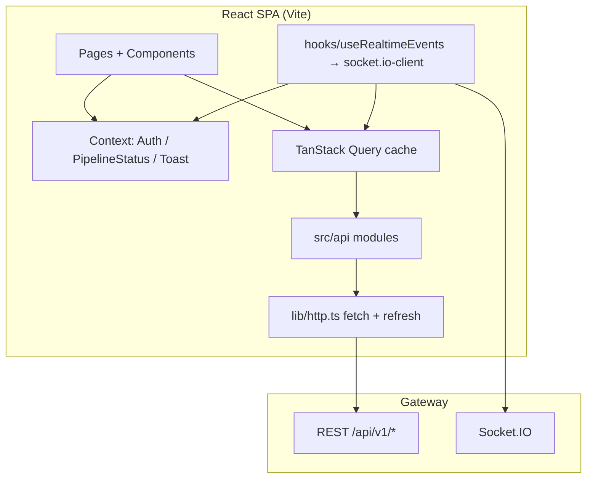

# Frontend Architecture Overview

## High-level diagram



## Entry and provider tree

`main.tsx` mounts the app with a fixed provider nesting order:

1. **`QueryClientProvider`** — server state defaults: `refetchOnWindowFocus: false`, `retry: 1`.
2. **`AuthProvider`** — user + JWT pair; persists to `localStorage`.
3. **`PipelineStatusProvider`** — ephemeral UI flags (sync/triage/draft “in progress” per thread).
4. **`ToastProvider`** — ephemeral notifications rendered by `ToastViewport`.

```19:31:frontend/src/main.tsx
ReactDOM.createRoot(document.getElementById('root')!).render(
  <React.StrictMode>
    <QueryClientProvider client={queryClient}>
      <AuthProvider>
        <PipelineStatusProvider>
          <ToastProvider>
            <App />
          </ToastProvider>
        </PipelineStatusProvider>
      </AuthProvider>
    </QueryClientProvider>
  </React.StrictMode>
);
```

## Routing

`App.tsx` uses **`BrowserRouter`**. Protected routes nest under **`RequireAuth`** (`components/RequireAuth.tsx`), which redirects unauthenticated visitors to **`/`**.

Global chrome: **`ToastViewport`** renders outside `<Routes>` so overlays work on every page.

See [02-pages-and-navigation.md](./02-pages-and-navigation.md).

## Styling strategy

Single global stylesheet **`src/styles.css`**. Utility layout classes are descriptive (`.app-shell`, `.nav-link`, `.landing-*`, etc.). There is no Tailwind/CSS-in-JS in this repo.

When adding screens, match existing semantic class names rather than introducing a second styling system unless the project explicitly migrates.

## Build and dev

| Command | Purpose |
|---------|---------|
| `npm run dev` | Vite dev server, port **3001** |
| `npm run build` | `tsc --noEmit` then `vite build` |
| `npm run preview` | Preview production build |

`vite.config.ts` sets `server.host = true` (LAN reachable during dev).

## TypeScript

`tsconfig.json`: `strict: true`, `"baseUrl": "./src"` (imports can use `./lib/...` style relative paths from `src` — convention in this codebase is still mostly relative from file).
