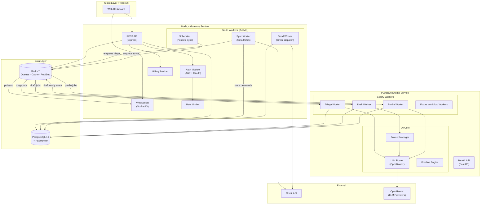
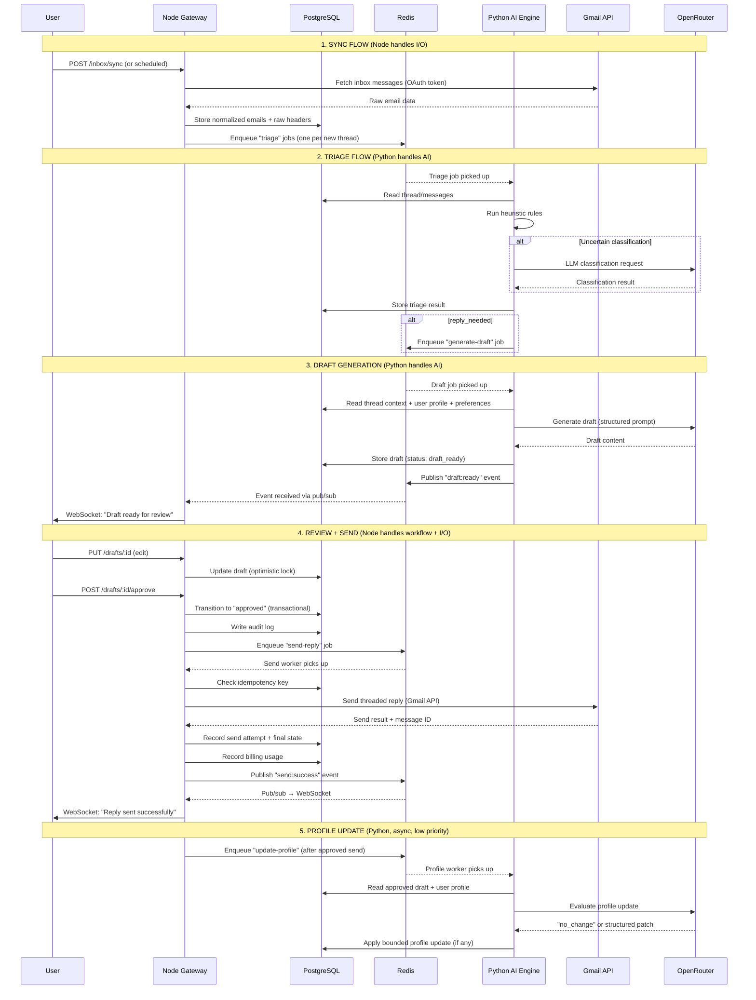
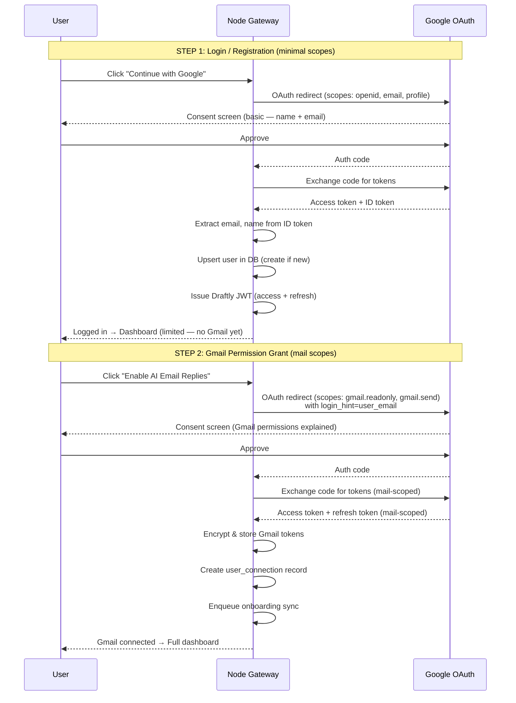
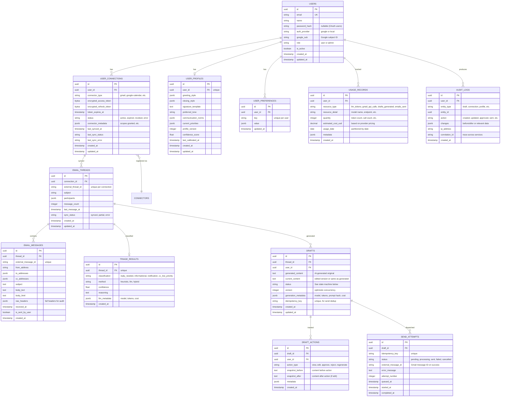
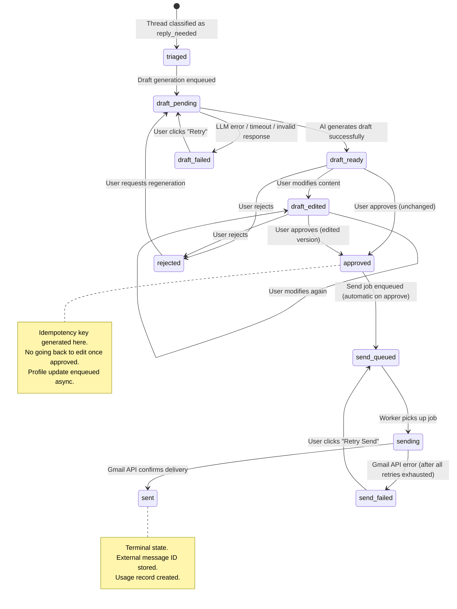
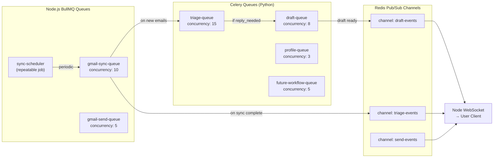
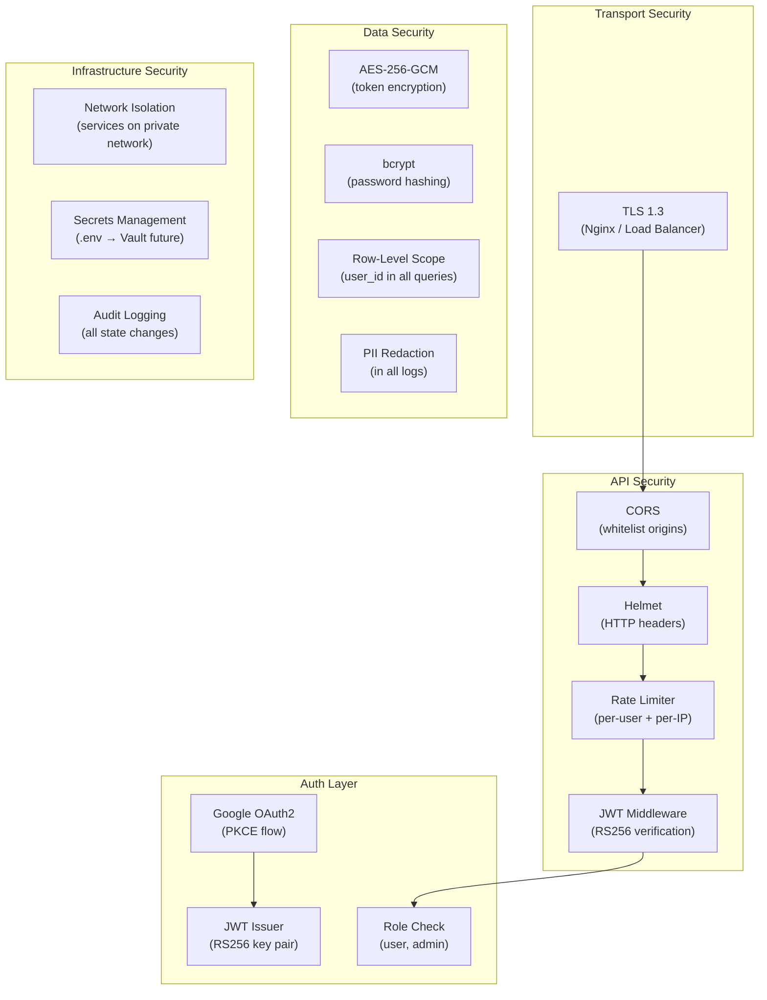
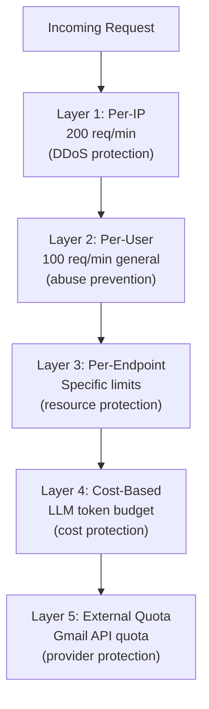

# Draftly — Complete System Design v2

# 1000 Users · ~300 Concurrency · Product-Grade Extensibility

---

## Table of Contents

1. [Executive Summary](#1-executive-summary)
2. [Architecture Pattern Decision](#2-architecture-pattern-decision)
3. [Dual-Service Architecture Decision](#3-dual-service-architecture-decision)
4. [High-Level Architecture](#4-high-level-architecture)
5. [Extensibility Framework Decision](#5-extensibility-framework-decision)
6. [Authentication & OAuth-First Decision](#6-authentication--oauth-first-decision)
7. [Domain Model & State Machine](#7-domain-model--state-machine)
8. [Database Schema Design](#8-database-schema-design)
9. [Node.js Gateway Service — Detailed Design](#9-nodejs-gateway-service--detailed-design)
10. [Python AI Engine Service — Detailed Design](#10-python-ai-engine-service--detailed-design)
11. [Inter-Service Communication Decision](#11-inter-service-communication-decision)
12. [Worker Pipeline & Queue Design](#12-worker-pipeline--queue-design)
13. [Security Design](#13-security-design)
14. [Rate Limiting Design](#14-rate-limiting-design)
15. [Billing & Cost Tracking Design](#15-billing--cost-tracking-design)
16. [Concurrency Model for ~300 Users](#16-concurrency-model-for-300-users)
17. [Observability](#17-observability)
18. [Project Structure](#18-project-structure)
19. [Infrastructure & Deployment](#19-infrastructure--deployment)
20. [Phased Build Order](#20-phased-build-order)
21. [Open Questions](#21-open-questions)
22. [Verification Plan](#22-verification-plan)

---

## 1. Executive Summary

Draftly is a **human-in-the-loop AI email reply assistant** being designed as a **capstone project with a clear product extension path**.

**Target scale**: 1000 registered users, ~300 peak concurrent, extensible to 10k+.

**Core decisions in this design:**

| Decision | Choice | Section |
|----------|--------|---------|
| Architecture pattern | Clean Architecture + Workflow Pipeline | §2 |
| Service topology | Dual-service (Node.js + Python) | §3 |
| Extensibility model | Workflow-first with Connector Registry | §5 |
| Authentication | OAuth-first (Google), traditional as secondary | §6 |
| LLM provider routing | OpenRouter (provider-agnostic) | §10 |
| Inter-service comms | Redis job queues + DB as shared state | §11 |
| Billing | Usage-tracking-first, payments deferred | §15 |

**Design philosophy**: Every architectural decision in this document includes a **Decision Record** with alternatives considered, pros/cons, when to use, when NOT to use, and why we chose what we did. This ensures full transparency and creates a reference for future evolution.

---

## 2. Architecture Pattern Decision

Before choosing any specific pattern, let's evaluate the candidates honestly.

### 2.1 Candidates Evaluated

#### Option A: Simple Layered (Controller → Service → Repository)

```
Controller → Service → Repository → Database
```

**Pros:**
- Easiest to understand and implement
- Fast to build
- Most tutorials and hiring candidates know this pattern
- Low ceremony

**Cons:**
- Business logic leaks across layers
- Tight coupling to frameworks and databases
- Hard to test business logic in isolation
- Adding a new integration (Calendar, Jira) requires changes across ALL layers
- Domain logic gets scattered: some in services, some in controllers, some in validators

**When to use:** Small CRUD apps, prototypes, hackathons, < 6 month lifespan.
**When NOT to use:** When you know the system will grow OR when business logic is the hard part (both true for Draftly).

---

#### Option B: Hexagonal / Ports & Adapters

```
                ┌─────────────────────┐
   Adapters     │    Domain Core      │     Adapters
  (Inbound)  ───│  (Business Logic)   │───  (Outbound)
  REST API      │  Ports (Interfaces) │     Gmail, DB, LLM
  WebSocket     └─────────────────────┘     Redis, etc.
```

**Pros:**
- Domain logic is completely isolated from infrastructure
- Extremely testable — mock any port
- Adding new adapters (Calendar, Jira) doesn't touch domain
- Framework-independent: can swap Express for Fastify, Postgres for Mongo
- Gold standard for DDD projects

**Cons:**
- High initial ceremony (ports, adapters, mappers)
- Over-engineered for simple CRUD pieces (user preferences, for example)
- Team needs to understand the pattern deeply or it degrades
- Lots of files and indirection — can slow down small teams
- The "purity" can become dogmatic and slow down pragmatic delivery

**When to use:** Complex domain logic, long-lived projects, teams > 3 people, systems that WILL swap infrastructure.
**When NOT to use:** When the domain is thin (mostly CRUD), when speed-to-market is critical, solo/duo teams on deadline.

---

#### Option C: Clean Architecture (Pragmatic variant)

```
┌─────────────────────────────────────────────────┐
│  Infrastructure Layer                            │
│  (Express, Gmail SDK, Postgres driver, Redis)    │
├─────────────────────────────────────────────────┤
│  Interface Layer                                 │
│  (Routes, Controllers, Job Handlers, DTOs)       │
├─────────────────────────────────────────────────┤
│  Application Layer                               │
│  (Use Cases / Services — orchestration logic)    │
├─────────────────────────────────────────────────┤
│  Domain Layer                                    │
│  (Entities, Value Objects, Domain Events, Rules)  │
└─────────────────────────────────────────────────┘
```

**Pros:**
- Dependency rule: inner layers don't know about outer layers
- Domain and application logic are testable without any infrastructure
- Less ceremony than full Hexagonal — pragmatic about adapters
- Use case layer makes workflows explicit (SyncInboxUseCase, GenerateDraftUseCase)
- Naturally supports our dual-service split (each service has its own layers)
- Widely understood, well-documented

**Cons:**
- Still more structure than simple layered
- Can feel like boilerplate for simple features
- Requires discipline to keep the dependency rule

**When to use:** Medium-to-large systems with complex business logic, product-oriented projects, multi-service architectures.
**When NOT to use:** Throwaway scripts, simple APIs with no business logic.

---

#### Option D: Event Sourcing + CQRS

**Pros:**
- Full audit trail built-in (every state change is an event)
- Natural fit for the draft lifecycle (events: DraftGenerated, DraftEdited, DraftApproved, ReplySent)
- CQRS separates read and write models for performance

**Cons:**
- Massive complexity increase for a capstone timeline
- Event store management is a project in itself
- Debugging distributed events is hard
- Eventually consistent reads can confuse users
- Team expertise required is significantly higher
- Overkill for 1000 users

**When to use:** Financial systems, audit-heavy compliance, systems where full history replay is a legal requirement.
**When NOT to use:** Projects under time pressure, teams without event sourcing experience, when the domain model is clear and state-based.

---

### 2.2 Decision: Clean Architecture (Pragmatic)

> **We choose Clean Architecture (Option C)** with selective borrowing from Hexagonal where it genuinely helps (specifically: Connector interfaces for external services).

**Rationale:**
1. It keeps domain logic isolated (testable, framework-independent)
2. The Use Case layer maps perfectly to our workflows (SyncInbox, TriageEmail, GenerateDraft, SendReply)
3. It naturally supports our dual-service split — each service has its own clean layers
4. It's not so heavy that it slows down a capstone timeline
5. We get audit logging through explicit use case boundaries, without the complexity of event sourcing
6. The dependency rule prevents the "leaked abstraction" problem of simple layered architectures

**What we borrow from Hexagonal:** Connector interfaces (outbound ports) for Gmail, LLM, and future integrations. This gives us swappability without full port/adapter ceremony.

**What we skip:** Inbound ports (our controllers directly call use cases — the indirection of an inbound port adds no value when we have one API framework). Full DDD aggregate roots (our domain is straightforward enough that entities + rules suffice).

---

## 3. Dual-Service Architecture Decision

### 3.1 Candidates Evaluated

#### Option A: Monolith (Single Service — Node.js)

```
┌─────────────────────────────────────────┐
│          Node.js Monolith               │
│  API + Workers + Gmail + LLM + DB      │
└─────────────────────────────────────────┘
```

**Pros:**
- Simplest deployment (1 container)
- No network hop latency
- Shared types, one language
- Easiest debugging (single process logs)
- Perfect for 100 users

**Cons:**
- Node.js AI/ML ecosystem is weak compared to Python
- LLM client libraries (LangChain, LlamaIndex, token counting) are Python-first
- Prompt engineering tooling is Python-dominant
- Scaling AI workers independently from API is impossible
- CPU-heavy LLM response parsing blocks the event loop (unless carefully managed)
- If you ever want to add ML-based classification, embeddings, or local models — you're stuck

**When to use:** Small team, fast deadline, AI interactions are simple (direct API call + response parse).
**When NOT to use:** When AI is the product's core value, when you need Python ML tooling, when AI workload should scale independently.

---

#### Option B: Monolith (Single Service — Python/FastAPI)

**Pros:**
- Best AI/ML ecosystem
- FastAPI is excellent for async
- One language, one deployment

**Cons:**
- Python's async story is mature but Node's is battle-tested for high-concurrency I/O
- OAuth/session management libraries are more mature in Node
- Real-time (WebSocket) handling is more natural in Node
- npm ecosystem for web middleware (helmet, cors, rate-limiting) is richer

**When to use:** AI-first product where web layer is thin.
**When NOT to use:** When you need sophisticated real-time web features alongside AI.

---

#### Option C: Dual Service (Node.js Gateway + Python AI Engine)

```
┌────────────────────┐    Redis Queues    ┌────────────────────┐
│  Node.js Service   │◄═════════════════►│  Python Service    │
│  (Gateway + I/O)   │    Shared PG DB    │  (AI Engine)       │
│                    │◄══════════════════►│                    │
│ • REST API         │                    │ • Triage pipeline  │
│ • OAuth/JWT Auth   │                    │ • Draft generation │
│ • Gmail I/O        │                    │ • Profile analysis │
│ • WebSocket        │                    │ • Prompt mgmt      │
│ • Rate limiting    │                    │ • LLM routing      │
│ • Send dispatch    │                    │ • Future AI flows  │
│ • Billing tracking │                    │ • Tool orchestration│
│ • DB operations    │                    │                    │
└────────────────────┘                    └────────────────────┘
         │                                         │
         ▼                                         ▼
   ┌──────────┐                              ┌──────────┐
   │ Gmail API │                              │OpenRouter│
   │ (fetch +  │                              │  (LLM)   │
   │  send)    │                              └──────────┘
   └──────────┘
```

**Pros:**
- **Best-of-breed languages**: Node does what it's best at (I/O, real-time, web), Python does what IT's best at (AI, ML, NLP)
- **Independent scaling**: AI workers can scale 3x while API stays at 2 instances
- **Team scalability**: Backend dev works on Node, AI/ML dev works on Python — clear ownership
- **AI evolution**: Adding embeddings, local models, classification ML, or complex agent workflows doesn't require touching the web layer
- **Fault isolation**: If the AI engine OOMs on a long prompt, the API stays up
- **Technology freedom**: Can swap FastAPI for a Go service later without touching the frontend-facing API

**Cons:**
- **Operational complexity**: 2 services to deploy, monitor, and debug instead of 1
- **Network latency**: Any synchronous call between services adds ~1-5ms
- **Shared state coordination**: Both services read/write PostgreSQL — schema changes affect both
- **Local dev setup**: Docker Compose with 2 custom services + Postgres + Redis (but this is manageable)
- **Type safety across boundary**: No shared TypeScript types — need to be disciplined about API contracts
- **Debugging distributed flows**: A draft generation spans both services — needs correlated request IDs

**When to use:** When AI IS the product differentiator, when you expect the AI layer to evolve rapidly, when independent scaling matters, when team will eventually have both backend and AI/ML engineers.
**When NOT to use:** Solo developer who won't touch AI code after initial setup, extremely simple LLM usage (just one API call), extreme time pressure where 2 services is too much.

---

#### Option D: Node Primary + Python Sidecar (thin LLM wrapper)

**Pros:**
- Simpler than full dual-service
- Python only does LLM calls, Node does everything else

**Cons:**
- Python service becomes a dumb HTTP→OpenRouter proxy — why bother?
- You lose the benefit of Python AI ecosystem for complex workflows
- As AI complexity grows, the sidecar becomes the bottleneck and needs to be restructured anyway

**When to use:** When LLM interaction is literally just "call API, return text" with no pipeline logic.
**When NOT to use:** When you have triage pipelines, prompt chains, profile analysis, and future AI workflows. (This is Draftly.)

---

### 3.2 Decision: Option C — Dual Service

> **We choose the Dual Service architecture (Node.js + Python).**

**Rationale:**
1. **AI is Draftly's core value** — the triage pipeline, draft generation, profile analysis, and all future extensions (classification, digest, newsletter) are AI workflows. They deserve a first-class home in Python.
2. **Extensibility story is stronger** — "Morning Digest" plugin = new Python workflow + new Celery task + new prompt. No Node changes needed.
3. **Independent scaling** — At 300 concurrent users during peak, we might need 5 draft generation workers but only 2 API instances. Scaling them independently is free with this architecture.
4. **OpenRouter Python SDK** is more mature and has better async support than the Node equivalent.
5. **Future-proof** — If you ever add semantic search, embeddings, or local model inference, Python is the only realistic option.

**What we accept as cost:**
- We will need Docker Compose for local dev (not a big deal — the 100-user design already assumed this)
- We need correlation IDs across services (will implement)
- Schema changes require coordination (migration tooling handles this)

### 3.3 Service Responsibility Split

| Responsibility | Node.js Gateway | Python AI Engine |
|---|---|---|
| User authentication (JWT, sessions) | ✅ Owns | ❌ |
| Google OAuth flow (redirect, callback, token exchange) | ✅ Owns | ❌ |
| Token storage & encrypted refresh | ✅ Owns | ❌ |
| REST API for frontend | ✅ Owns | ❌ |
| WebSocket real-time notifications | ✅ Owns | ❌ |
| Rate limiting & API security | ✅ Owns | ❌ |
| Gmail API I/O (fetch inbox, send reply) | ✅ Owns | ❌ |
| Database CRUD (users, connections, threads, drafts) | ✅ Primary | 🔶 Reads + writes results |
| Billing & usage tracking | ✅ Owns | 🔶 Reports usage |
| Email parsing & normalization | ❌ | ✅ Owns |
| Triage pipeline (heuristic + LLM) | ❌ | ✅ Owns |
| Draft generation pipeline | ❌ | ✅ Owns |
| User profile analysis & update | ❌ | ✅ Owns |
| Prompt management | ❌ | ✅ Owns |
| LLM provider interaction (OpenRouter) | ❌ | ✅ Owns |
| Future AI workflows (digest, newsletter, etc.) | ❌ | ✅ Owns |

---

## 4. High-Level Architecture



### 4.1 Data Flow for Core Workflow



---

## 5. Extensibility Framework Decision

### 5.1 Candidates Evaluated

#### Option A: Adapter Pattern (Gang of Four)
Wrap each external service behind a common interface. `IEmailAdapter`, `ICalendarAdapter`, etc.

**Pros:** Simple, type-safe, well-understood.
**Cons:** Too low-level. It abstracts _individual services_ but doesn't help compose _workflows_ across services. Adding "Morning Digest" still requires wiring together sync + LLM + new scheduling — the adapter pattern doesn't tell you how.

#### Option B: Plugin System (like VSCode, n8n)
Each use case is a self-contained plugin that registers routes, jobs, and capabilities.

**Pros:** Highly extensible, dynamic registration.
**Cons:** Heavyweight framework to build. Plugin lifecycle management adds complexity. For a capstone + early product, you're building a platform before you have a product.

#### Option C: Workflow-First with Connector Registry

Separate the concerns into:
1. **Connectors** — How you talk to external services (Gmail, Calendar, Jira, OpenRouter)
2. **Workflows** — Sequences of steps that compose connectors and AI to do useful work
3. **Registry** — How connectors and workflows are discovered and configured

```
┌──────────────────────────────────────────────┐
│              Workflows                        │
│  EmailReplyWorkflow, MorningDigestWorkflow   │
│  ClassificationWorkflow, MeetingFollowup      │
├──────────────────────────────────────────────┤
│           Workflow Engine                      │
│  Pipeline stages, branching, scheduling       │
├──────────────────────────────────────────────┤
│         Connector Registry                    │
│  Gmail, Calendar, Jira, OpenRouter            │
├──────────────────────────────────────────────┤
│           Infrastructure                      │
│  Queue, DB, Cache, Auth                       │
└──────────────────────────────────────────────┘
```

**Pros:**
- Extensibility is at the _workflow_ level, which maps to user-visible features
- Adding "Morning Digest" = new workflow definition + new Celery tasks + new prompts → zero changes to existing code
- Connectors are simple and practical — no abstract interface ceremony
- Doesn't require building a plugin framework
- Each workflow is independently testable

**Cons:**
- Requires thoughtful workflow stage design upfront
- Shared state between workflows needs careful handling
- Not as dynamic as a full plugin system (workflows are code, not config)

---

### 5.2 Decision: Option C — Workflow-First with Connector Registry

> **We choose the Workflow-First approach** because extensibility in Draftly means **adding new use cases** (digest, newsletter, calendar-aware replies), not just swapping adapters. The workflow is the unit of extensibility.

**How it works concretely:**

```python
# Python AI Engine — Workflow definition

class EmailReplyWorkflow:
    """Core capstone workflow: Sync → Triage → Draft → Review → Send"""
    name = "email-reply"
    required_connectors = ["gmail", "openrouter"]
    
    stages = [
        TriageStage,         # Heuristic + LLM classification
        DraftGenerationStage, # Context assembly + LLM drafting
        ProfileUpdateStage,   # Post-approval profile refinement
    ]

class MorningDigestWorkflow:
    """Future: Generate a morning summary of yesterday's emails"""
    name = "morning-digest"
    required_connectors = ["gmail", "openrouter"]
    
    stages = [
        FetchYesterdayEmailsStage,   # Reuses Gmail connector
        SummarizeEmailsStage,         # New LLM prompt
        GenerateDigestStage,          # New LLM prompt
        DeliverDigestStage,           # Email or push notification
    ]

class CalendarAwareReplyWorkflow:
    """Future: Enrich email replies with calendar context"""
    name = "calendar-reply"
    required_connectors = ["gmail", "google-calendar", "openrouter"]
    
    stages = [
        TriageStage,              # REUSED from EmailReplyWorkflow
        FetchCalendarContextStage, # New stage using Calendar connector
        DraftWithCalendarStage,    # Enhanced draft generation
        ProfileUpdateStage,        # REUSED
    ]
```

```typescript
// Node.js Gateway — Connector Registry

class ConnectorRegistry {
  private connectors: Map<string, ConnectorConfig> = new Map();

  register(name: string, config: ConnectorConfig): void;
  get(name: string): ConnectorConfig;
  isAvailable(name: string): boolean;
  
  // Health check all registered connectors
  healthCheckAll(): Promise<Map<string, HealthStatus>>;
}

// ConnectorConfig is deliberately simple — not an abstract interface
interface ConnectorConfig {
  name: string;            // 'gmail', 'google-calendar', 'jira'
  authType: 'oauth2' | 'api-key' | 'basic';
  baseUrl: string;
  scopes?: string[];       // OAuth scopes required
  quotaLimits?: QuotaConfig;
  healthEndpoint?: string;
}
```

**Key insight: Connectors are configuration, not abstraction.** We don't need `IEmailAdapter.fetchInbox()` when we have a well-structured `GmailService.fetchInbox()`. The connector registry tracks what's available and healthy. The workflows define how things compose.

**Extensibility example — adding Jira integration:**
1. Add `JiraConnector` config to registry (Node.js)
2. Add `JiraService` for API calls (Node.js or Python, depending on the use case)
3. Add `JiraEmailBridgeWorkflow` (Python)
4. Register new Celery tasks for the workflow
5. Add API routes for Jira-specific UI actions (Node.js)
6. **Zero changes to existing email reply workflow**

---

## 6. Authentication & OAuth-First Decision

### 6.1 Candidates Evaluated

#### Option A: Traditional Register/Login First, OAuth Later

```
User → Register (email/password) → Login → Dashboard → Connect Gmail (separate OAuth)
```

**Pros:**
- Users can explore the dashboard before committing to Gmail access
- Simpler auth implementation (bcrypt + JWT)
- Works without Google Cloud project during early dev

**Cons:**
- Creates a pointless account for a product that REQUIRES Gmail to function
- User has to go through TWO auth flows (register + OAuth)
- The product value is zero until Gmail is connected, so exploring the dashboard first is meaningless
- Higher drop-off: every extra step loses users

---

#### Option B: OAuth-First (Google Login), Traditional as Secondary

```
User → "Continue with Google" → Google OAuth (profile scope) → Auto-register → Dashboard
→ "Enable AI Replies" → Gmail OAuth (mail scope) → Full workflow active
```

**Pros:**
- **Lowest friction**: One click to register AND log in
- **Two-step consent**: First OAuth gets basic profile (email, name) — low scary factor. Second OAuth requests Gmail read/send — user understands WHY because they've seen the dashboard
- **Google's recommended pattern**: Incremental consent — ask for permissions as they're needed
- **Account always has a verified email** (from Google)
- **Still allows email/password** for admin accounts, API-only users, or non-Gmail users later

**Cons:**
- Requires Google Cloud project with OAuth consent screen from day 1
- Can't test auth flow without Google project setup
- Users with Google Workspace (company) accounts might have restricted OAuth

---

#### Option C: Merged Single OAuth (Login + Gmail Access in One Step)

```
User → "Continue with Google" → OAuth (profile + mail scope) → Auto-register → Full access
```

**Pros:**
- Absolute minimum friction (one click, one consent screen)

**Cons:**
- **Scary consent screen**: Asking for mail.send permission BEFORE the user has seen the product terrifies people
- **Higher rejection rate**: Users will decline Gmail permissions upfront
- **Google review**: Sensitive scopes (mail.send) require Google's OAuth review — combining with login makes the review harder
- **No graceful degradation**: User can't use the product at all if they decline mail permissions

---

### 6.2 Decision: Option B — OAuth-First with Incremental Consent

**Implementation flow:**



**Why two steps:**
1. **Psychology**: "Login with Google" requests `openid, email, profile` — users see this as normal.  "Read and send your email" is a bigger ask — but at this point the user understands WHY and has seen the product.
2. **Google's review process**: Sensitive scopes (mail) require separate OAuth consent review. Keeping login and mail scopes in separate flows makes the review cleaner.
3. **Graceful degradation**: User CAN use the dashboard in a limited way (view settings, profile) even before granting Gmail access. This isn't meaningless — it establishes trust.

**Traditional auth as secondary:**
- Email/password registration available at `/api/v1/auth/register`
- JWT login at `/api/v1/auth/login`
- Use case: admin accounts, CI/CD testing, future non-Gmail users
- Not promoted in UI — just exists as API endpoints

---

## 7. Domain Model & State Machine

### 7.1 Core Entities



### 7.2 Draft State Machine



**State transition rules (enforced in domain layer):**

| From | To | Condition | Side Effects |
|------|----|-----------|--------------|
| triaged → draft_pending | Draft generation queued | Always | Celery job enqueued |
| draft_pending → draft_ready | LLM returns valid draft | AI validation passes | Draft stored, WebSocket event |
| draft_pending → draft_failed | LLM error or invalid | After retries exhausted | Error logged |
| draft_ready → approved | User explicit action | Draft exists, correct version | Audit log, idempotency key generated, send enqueued |
| draft_edited → approved | User explicit action | Draft exists, content not empty, correct version | Audit log |
| approved → send_queued | Automatic | Idempotency key doesn't exist in send_attempts as 'sent' | BullMQ job enqueued |
| send_queued → sent | Gmail confirms | External message ID returned | Usage record, audit log, WebSocket |
| send_queued → send_failed | Gmail rejects | After max retries | Error captured, alert |

---

## 8. Database Schema Design

### 8.1 Design Decisions

| Decision | Choice | Why | Alternative Considered | Why Rejected |
|----------|--------|-----|----------------------|--------------|
| **Primary keys** | UUID v7 | Time-sortable (no random scatter), globally unique (no sequence contention), safe for distributed systems | Auto-increment BIGINT | Sequence contention at scale, leaks ordering info, breaks if you ever shard |
| **Token encryption** | `bytea` with AES-256-GCM (app-level) | Case study requires AES encryption; app-level gives flexibility | pgcrypto (db-level) | App-level encryption means DB compromise alone doesn't expose tokens |
| **JSON fields** | `jsonb` | Flexible schemas for metadata, raw headers; query-able and indexable | Separate tables | Over-normalization for data that's always read/written as a unit |
| **Partitioning** | Range partition by `usage_date` on usage_records, `created_at` on audit_logs | These tables grow linearly with time; partitioning enables efficient pruning and queries | No partitioning | 1000 users × 365 days = millions of usage records; unpartitioned scans become painful |
| **Connection pooling** | PgBouncer (transaction mode) | 300 concurrent users → need to multiplex ~300 app connections onto ~80 PG connections | Direct connections | PostgreSQL fork-per-connection model fails at 300+ connections (memory, context switching) |
| **Soft deletes** | `is_active` on users, `status` fields on connections | Audit trail preservation; regulatory compliance for future | Hard deletes | Lose history, potential referential integrity issues |

### 8.2 Critical Indexes

```sql
-- User lookup (OAuth login flow)
CREATE UNIQUE INDEX idx_users_email ON users(email);
CREATE UNIQUE INDEX idx_users_google_sub ON users(google_sub) WHERE google_sub IS NOT NULL;

-- Connection lookup (token refresh, sync scheduling)
CREATE INDEX idx_connections_user_status ON user_connections(user_id, status);
CREATE INDEX idx_connections_next_sync ON user_connections(last_synced_at) WHERE status = 'active';

-- Thread queries (dashboard, worker)
CREATE UNIQUE INDEX idx_threads_external ON email_threads(connection_id, external_thread_id);
CREATE INDEX idx_threads_last_msg ON email_threads(connection_id, last_message_at DESC);

-- Message deduplication
CREATE UNIQUE INDEX idx_messages_external ON email_messages(external_message_id);

-- Draft dashboard (most common user query)
CREATE INDEX idx_drafts_user_status ON drafts(user_id, status) 
    WHERE status NOT IN ('sent', 'rejected');
CREATE INDEX idx_drafts_thread ON drafts(thread_id);

-- Send idempotency (critical safety)
CREATE UNIQUE INDEX idx_send_idemp ON send_attempts(idempotency_key);

-- Triage lookup (one per thread)
CREATE UNIQUE INDEX idx_triage_thread ON triage_results(thread_id);

-- Usage billing (monthly aggregation)
CREATE INDEX idx_usage_user_date ON usage_records(user_id, usage_date);
CREATE INDEX idx_usage_type_date ON usage_records(resource_type, usage_date);

-- Audit trail
CREATE INDEX idx_audit_user ON audit_logs(user_id, created_at DESC);
CREATE INDEX idx_audit_correlation ON audit_logs(correlation_id);
```

### 8.3 Connection Pooling Architecture

```
                           ┌────────────────────────────┐
 Node API Instance 1 ────►│                            │
   (pool_size: 20)        │                            │     ┌──────────────────┐
                          │      PgBouncer             │────►│                  │
 Node API Instance 2 ────►│  (transaction mode)        │     │  PostgreSQL 16   │
   (pool_size: 20)        │  max_client_conn: 300      │     │  max_conn: 100   │
                          │  default_pool_size: 40     │     │                  │
 Node Workers ────────────►│  reserve_pool_size: 10     │     │  Read Replica    │
   (pool_size: 15)        │                            │────►│  (dashboard      │
                          │                            │     │   read queries)  │
 Python AI Engine ────────►│                            │     │                  │
   (pool_size: 15)        └────────────────────────────┘     └──────────────────┘
```

**Why PgBouncer in transaction mode (not session mode):**
- Transaction mode returns connections to pool after each transaction ends
- Session mode holds connections for the full client session — defeats pooling for long-lived app connections
- Our queries are short transactions, not long-running sessions
- 300 app connections multiplex onto ~40 PG connections efficiently

**When NOT to use transaction mode:** If you need LISTEN/NOTIFY, prepared statements across transactions, or SET session-level variables. We use Redis pub/sub instead of LISTEN/NOTIFY, so this doesn't affect us.

---

## 9. Node.js Gateway Service — Detailed Design

### 9.1 Technology Choices

| Concern | Choice | Why | Alternative | Why Not |
|---------|--------|-----|-------------|---------|
| Runtime | Node.js 20 LTS | Mature, battle-tested async I/O, excellent for API serving | Bun, Deno | Stability + ecosystem maturity required for production |
| Language | TypeScript (strict mode) | Type safety, refactoring confidence, better DX | JavaScript | Unacceptable for production codebase of this size |
| Framework | Express 5 | Most middleware ecosystem, most battle-tested, most hiring candidates know it | Fastify | Fastify is faster but Express's middleware ecosystem (passport, helmet, rate-limit) is more mature |
| ORM/Query | Knex.js (query builder) | SQL control without full ORM overhead, clean migrations | Prisma, TypeORM | Prisma has poor raw SQL support; TypeORM's query builder is less mature. We want SQL control for complex queries |
| Auth | Passport.js (Google strategy) + custom JWT | Battle-tested OAuth flow, flexible JWT layer on top | Custom OAuth from scratch | Don't reimplement OAuth — security-critical code shouldn't be artisanal |
| Job Queue | BullMQ | Best Node.js Redis-backed queue, supports rate limiting, priorities, repeatable jobs | Agenda (Mongo), pg-boss (Postgres) | Redis-backed is faster; BullMQ is the most maintained |
| WebSocket | Socket.IO | Built-in rooms (per-user channels), reconnection, fallback transport | ws (raw), µWebSockets | Socket.IO's room abstraction + client reconnection handling saves significant work |
| Validation | Zod | Runtime type validation with TypeScript integration, great error messages | Joi, Yup | Zod's TypeScript inference is superior |
| Encryption | Node crypto (AES-256-GCM) | Built-in, no dependency, fast | libsodium | Built-in is sufficient for our use case |
| Logging | Pino | Fastest Node.js logger, structured JSON output | Winston | Winston is 5x slower; Pino's speed matters at 300 concurrent |
| Testing | Jest + Supertest | Most widespread, good TS support, Supertest for HTTP assertions | Vitest | Vitest is faster but Jest's ecosystem is more mature |

### 9.2 API Contract

#### Authentication

| Method | Endpoint | Body / Params | Response | Auth | Rate Limit |
|--------|----------|---------------|----------|------|------------|
| GET | `/api/v1/auth/google` | `?redirect_uri=` | 302 → Google consent | Public | 10/min/IP |
| GET | `/api/v1/auth/google/callback` | `?code=&state=` | `{ user, tokens }` | Public | 10/min/IP |
| POST | `/api/v1/auth/register` | `{ email, password, name }` | `{ user, tokens }` | Public | 5/min/IP |
| POST | `/api/v1/auth/login` | `{ email, password }` | `{ user, tokens }` | Public | 10/min/IP |
| POST | `/api/v1/auth/refresh` | `{ refreshToken }` | `{ accessToken }` | Refresh Token | 30/min/user |
| POST | `/api/v1/auth/logout` | — | 204 | JWT | 10/min/user |

#### Connections (Gmail, future: Calendar, Jira)

| Method | Endpoint | Body / Params | Response | Auth | Rate Limit |
|--------|----------|---------------|----------|------|------------|
| POST | `/api/v1/connections/initiate` | `{ connectorType: "gmail" }` | `{ authUrl }` | JWT | 5/min/user |
| GET | `/api/v1/connections/callback` | `?code=&state=&connector=` | `{ connection }` | JWT | 5/min/user |
| GET | `/api/v1/connections` | — | `{ connections[] }` | JWT | 60/min/user |
| GET | `/api/v1/connections/:id` | — | `{ connection }` | JWT | 60/min/user |
| DELETE | `/api/v1/connections/:id` | — | 204 | JWT | 5/min/user |
| POST | `/api/v1/connections/:id/reconnect` | — | `{ authUrl }` | JWT | 5/min/user |

#### Inbox & Threads

| Method | Endpoint | Body / Params | Response | Auth | Rate Limit |
|--------|----------|---------------|----------|------|------------|
| POST | `/api/v1/inbox/sync` | `{ connectionId? }` | `{ jobId }` | JWT | 5/min/user |
| GET | `/api/v1/inbox/threads` | `?status=&page=&limit=&sort=` | `{ threads[], pagination }` | JWT | 60/min/user |
| GET | `/api/v1/inbox/threads/:id` | — | `{ thread, messages[], triage? }` | JWT | 60/min/user |

#### Drafts & Workflow

| Method | Endpoint | Body / Params | Response | Auth | Rate Limit |
|--------|----------|---------------|----------|------|------------|
| GET | `/api/v1/drafts` | `?status=&page=&limit=` | `{ drafts[], pagination }` | JWT | 60/min/user |
| GET | `/api/v1/drafts/:id` | — | `{ draft, thread, actions[] }` | JWT | 60/min/user |
| PUT | `/api/v1/drafts/:id` | `{ content, expectedVersion }` | `{ draft }` | JWT | 30/min/user |
| POST | `/api/v1/drafts/:id/approve` | `{ expectedVersion }` | `{ draft, sendAttempt }` | JWT | 10/min/user |
| POST | `/api/v1/drafts/:id/reject` | `{ reason? }` | `{ draft }` | JWT | 10/min/user |
| POST | `/api/v1/drafts/:id/regenerate` | — | `{ draft, jobId }` | JWT | 5/min/user |

#### Profile & Preferences

| Method | Endpoint | Body / Params | Response | Auth | Rate Limit |
|--------|----------|---------------|----------|------|------------|
| GET | `/api/v1/profile` | — | `{ profile }` | JWT | 30/min/user |
| PUT | `/api/v1/profile` | `{ partial profile fields }` | `{ profile }` | JWT | 10/min/user |
| GET | `/api/v1/preferences` | — | `{ preferences }` | JWT | 30/min/user |
| PUT | `/api/v1/preferences` | `{ key, value }` | `{ preference }` | JWT | 10/min/user |

#### History, Usage & Billing

| Method | Endpoint | Body / Params | Response | Auth | Rate Limit |
|--------|----------|---------------|----------|------|------------|
| GET | `/api/v1/history/sends` | `?page=&limit=&from=&to=` | `{ sends[], pagination }` | JWT | 30/min/user |
| GET | `/api/v1/history/actions` | `?page=&limit=&entityType=` | `{ actions[], pagination }` | JWT | 30/min/user |
| GET | `/api/v1/usage` | `?from=&to=` | `{ usage by resource }` | JWT | 30/min/user |
| GET | `/api/v1/usage/summary` | `?month=` | `{ totalCost, breakdown }` | JWT | 10/min/user |

#### Admin (API key auth or admin JWT)

| Method | Endpoint | Response | Auth |
|--------|----------|----------|------|
| GET | `/api/v1/admin/health` | Component health status | API Key |
| GET | `/api/v1/admin/metrics` | Prometheus metrics | API Key |
| GET | `/api/v1/admin/queues` | Queue backlogs and stats | API Key |
| GET | `/api/v1/admin/users` | User listing with stats | Admin JWT |
| GET | `/api/v1/admin/usage/global` | Global usage statistics | Admin JWT |

### 9.3 WebSocket Events

```typescript
// Events sent by Node Gateway to connected clients
interface ServerToClientEvents {
  // Sync events
  'sync:started':     { connectionId: string; jobId: string };
  'sync:progress':    { connectionId: string; processed: number; total: number };
  'sync:completed':   { connectionId: string; newThreads: number; updatedThreads: number };
  'sync:failed':      { connectionId: string; error: string };

  // Triage events (triggered by Python worker via Redis pub/sub)
  'triage:completed': { threadId: string; classification: string; confidence: number };

  // Draft events (triggered by Python worker via Redis pub/sub)
  'draft:ready':      { draftId: string; threadId: string; subject: string };
  'draft:failed':     { draftId: string; threadId: string; error: string };

  // Send events
  'send:queued':      { draftId: string; attemptId: string };
  'send:success':     { draftId: string; externalMessageId: string };
  'send:failed':      { draftId: string; error: string; retryable: boolean };

  // Connection alerts
  'connection:expiring': { connectionId: string; expiresAt: string };
  'connection:expired':  { connectionId: string; reconnectUrl: string };
}
```

---

## 10. Python AI Engine Service — Detailed Design

### 10.1 Technology Choices

| Concern | Choice | Why | Alternative | Why Not |
|---------|--------|-----|-------------|---------|
| Framework | FastAPI | Async-first, auto-docs (OpenAPI), Pydantic validation, best Python web framework | Flask, Django | Flask lacks async; Django is too heavy for a worker-focused service |
| Task Queue | Celery 5 | Industry standard for Python async tasks, mature, horizontally scalable | Dramatiq, Huey | Celery's ecosystem (monitoring, retry, rate limit) is unmatched |
| Broker | Redis (shared with Node) | Single Redis instance for both BullMQ (Node) and Celery (Python) — different key prefixes | RabbitMQ | Adding RabbitMQ = another infra component. Redis handles both fine at this scale |
| LLM Client | LiteLLM | Provider-agnostic client — OpenRouter, OpenAI, Anthropic, Gemini all behind one interface | Raw HTTP, LangChain | LangChain is too heavy; raw HTTP means reimplementing retry, streaming, token counting. LiteLLM is the sweet spot |
| ORM/Query | SQLAlchemy 2.0 (async) | Most mature Python ORM, excellent async support, migration syncs with Knex | raw psycopg3 | Too low-level for Python service needs |
| DB Driver | asyncpg | Fastest async PostgreSQL driver | psycopg3 | asyncpg is 3x faster for bulk reads |
| Validation | Pydantic v2 | Built into FastAPI, fast, excellent validation | marshmallow | Pydantic v2 is faster and integrated |
| Testing | pytest + pytest-asyncio | Standard Python testing | unittest | pytest is more readable and extensible |

### 10.2 AI Pipeline Architecture

```python
# Conceptual architecture — not final implementation

class Pipeline:
    """A composable sequence of stages that transforms data."""
    
    def __init__(self, name: str, stages: list[Stage]):
        self.name = name
        self.stages = stages
    
    async def execute(self, context: PipelineContext) -> PipelineResult:
        for stage in self.stages:
            context = await stage.process(context)
            if context.should_stop:
                break
        return context.result

class Stage(ABC):
    """A single step in a pipeline."""
    
    @abstractmethod
    async def process(self, context: PipelineContext) -> PipelineContext:
        pass

# ---- Triage Pipeline ----
triage_pipeline = Pipeline("triage", [
    LoadThreadContextStage(),       # Read thread + messages from DB
    HeuristicClassificationStage(), # Fast rule-based check
    LLMClassificationStage(),       # Only if heuristic is uncertain
    StoreTriageResultStage(),       # Write result to DB
    EnqueueDraftIfNeededStage(),    # Conditional next step
])

# ---- Draft Generation Pipeline ----
draft_pipeline = Pipeline("draft-generation", [
    LoadThreadContextStage(),        # Reusable stage
    LoadUserProfileStage(),          # Profile + preferences
    AssemblePromptContextStage(),    # Build structured prompt
    SummarizeThreadIfLongStage(),    # Compress long threads for token efficiency
    GenerateDraftStage(),            # LLM call via OpenRouter
    ValidateDraftStage(),            # Check for hallucinations, format issues
    StoreDraftStage(),               # Write to DB
    NotifyDraftReadyStage(),         # Redis pub/sub → Node → WebSocket
    RecordUsageStage(),              # Track LLM tokens + cost
])

# ---- Profile Update Pipeline ----
profile_pipeline = Pipeline("profile-update", [
    LoadApprovedDraftStage(),        # What the user actually sent
    LoadCurrentProfileStage(),       # Current profile state
    EvaluateProfileUpdateStage(),    # LLM: should profile change?
    ApplyBoundedUpdateStage(),       # Only structured, bounded changes
    RecordUsageStage(),              # Track cost
])
```

**Why Pipeline pattern here (not just a function):**
- **Composability**: `MorningDigestWorkflow` can reuse `LoadThreadContextStage` and `AssemblePromptContextStage`
- **Observability**: Each stage can log timing, input/output size, errors independently
- **Error isolation**: A failure in `GenerateDraftStage` doesn't corrupt the context loaded in earlier stages
- **Testing**: Stages are unit-testable in isolation
- **Pipeline is data, not code**: Future admin UI could display pipeline progress to users

**When Pipeline pattern is overkill:** Simple one-shot operations (health check, single DB write). Don't pipeline everything.

### 10.3 LLM Integration (OpenRouter via LiteLLM)

```python
class LLMRouter:
    """
    Routes LLM requests through OpenRouter with fallback,
    retry, cost tracking, and circuit breaking.
    """
    
    def __init__(self, config: LLMConfig):
        self.primary_model = config.primary_model      # e.g. "openrouter/google/gemini-2.0-flash"
        self.fallback_model = config.fallback_model    # e.g. "openrouter/anthropic/claude-3.5-haiku"
        self.circuit_breaker = CircuitBreaker(
            failure_threshold=5,
            recovery_timeout=60
        )
    
    async def complete(
        self,
        messages: list[dict],
        model_override: str | None = None,
        temperature: float = 0.7,
        max_tokens: int = 2000,
        structured_output: type[BaseModel] | None = None,
    ) -> LLMResponse:
        """
        Send a completion request with retry, fallback, and cost tracking.
        """
        model = model_override or self.primary_model
        
        try:
            response = await self.circuit_breaker.call(
                litellm.acompletion,
                model=model,
                messages=messages,
                temperature=temperature,
                max_tokens=max_tokens,
                response_format=structured_output,
            )
        except CircuitOpenError:
            # Fallback to secondary model
            response = await litellm.acompletion(
                model=self.fallback_model,
                messages=messages,
                temperature=temperature,
                max_tokens=max_tokens,
            )
        
        return LLMResponse(
            content=response.choices[0].message.content,
            model_used=response.model,
            input_tokens=response.usage.prompt_tokens,
            output_tokens=response.usage.completion_tokens,
            estimated_cost=self._calculate_cost(response),
        )
    
    def _calculate_cost(self, response) -> Decimal:
        """Calculate cost based on OpenRouter's pricing."""
        # OpenRouter returns cost in the response headers
        pass
```

### 10.4 Prompt Management

```python
# Prompts are structured, versioned, and separate from logic

class PromptManager:
    """
    Manages prompt templates with versioning.
    Templates are Jinja2 with structured sections.
    """
    
    def get_triage_prompt(self, context: TriageContext) -> list[dict]:
        return [
            {"role": "system", "content": self._render("triage/system_v2.j2")},
            {"role": "user", "content": self._render("triage/user_v2.j2", {
                "subject": context.subject,
                "from": context.from_address,
                "to": context.to_addresses,
                "cc": context.cc_addresses,
                "body_preview": context.body_preview[:500],
                "is_user_in_to": context.is_user_in_to,
                "has_question_marks": context.has_question_marks,
                "thread_length": context.thread_length,
            })},
        ]
    
    def get_draft_prompt(self, context: DraftContext) -> list[dict]:
        return [
            {"role": "system", "content": self._render("draft/system_v3.j2", {
                "user_profile": context.user_profile,
                "signature": context.signature,
                "tone": context.preferred_tone,
                "constraints": [
                    "Do not make commitments the user hasn't authorized",
                    "Do not hallucinate facts not in the thread",
                    "Keep the reply concise and professional",
                    "Match the user's writing style from their profile",
                    "This is a DRAFT — the user will review before sending",
                ],
            })},
            {"role": "user", "content": self._render("draft/user_v3.j2", {
                "thread_summary": context.thread_summary,
                "latest_message": context.latest_message,
                "sender_info": context.sender_info,
                "thread_context": context.thread_context,
            })},
        ]
```

---

## 11. Inter-Service Communication Decision

### 11.1 Candidates Evaluated

#### Option A: gRPC (synchronous, type-safe)

**Pros:** Type-safe with protobuf, fast binary protocol, streaming support, code generation.
**Cons:** More setup (proto files, code gen), overkill when most communication is async, debugging is harder than JSON/HTTP.
**When to use:** High-frequency synchronous calls between services, where type safety across languages is critical.

#### Option B: REST/HTTP (synchronous, simple)

**Pros:** Simple, debuggable with curl, human-readable, every developer knows it.
**Cons:** Slower than gRPC, no streaming, no type safety across languages.
**When to use:** Infrequent synchronous calls, when debugging simplicity matters.

#### Option C: Redis Queues (async, decoupled)

**Pros:** True async, services don't need to be up simultaneously, natural backpressure, retry built-in.
**Cons:** No synchronous call support, shared Redis dependency, different queue libraries (BullMQ vs Celery) need compatible job format.
**When to use:** When most interaction is "do this work and tell me when done."

#### Option D: Hybrid — Redis Queues for Async + Redis Pub/Sub for Events + HTTP for Health/Admin

The analysis:

| Interaction | Pattern | Why |
|-------------|---------|-----|
| Node → Python (triage job) | Redis queue (Celery-compatible) | Async, retryable, rate-limitable |
| Node → Python (draft job) | Redis queue (Celery-compatible) | Async, retryable |
| Python → Node (draft ready event) | Redis pub/sub | Real-time notification, fire-and-forget |
| Python → DB (write results) | Direct PostgreSQL | Both services share DB — simplest for writes |
| Node checks Python health | HTTP GET (FastAPI health) | Synchronous, infrequent |
| Python reports usage | Direct PostgreSQL write | Simple, transactional |

### 11.2 Decision: Option D — Hybrid

> **Redis queues for async jobs + Redis pub/sub for real-time events + shared PostgreSQL for data + HTTP for health checks.**

**Implementation detail — how Node enqueues to Celery:**

```typescript
// Node doesn't use Celery. It writes a Celery-compatible job message to Redis.
// This is a well-documented Celery protocol:

class CeleryBridge {
  /**
   * Enqueue a task for Python Celery workers.
   * Uses Celery's v2 message protocol on Redis.
   */
  async enqueueTask(
    taskName: string,
    args: any[],
    kwargs: Record<string, any>,
    options: { queue?: string; countdown?: number; priority?: number } = {}
  ): Promise<string> {
    const taskId = uuid();
    const message = {
      body: JSON.stringify([args, kwargs, { callbacks: null, errbacks: null }]),
      headers: {
        id: taskId,
        task: taskName,
        lang: 'py',
        root_id: taskId,
        // ... Celery v2 protocol headers
      },
      properties: {
        delivery_tag: uuid(),
        delivery_mode: 2,  // persistent
        priority: options.priority ?? 0,
      },
      'content-type': 'application/json',
      'content-encoding': 'utf-8',
    };

    await this.redis.lpush(
      options.queue ?? 'celery',
      JSON.stringify(message)
    );

    return taskId;
  }
}
```

**Alternative considered**: We could use a thin HTTP API on the Python service where Node POSTs job requests. But this makes Node block until Python accepts, adds a synchronous dependency, and loses queue benefits (retry, backpressure, rate limiting). The queue approach is strictly better for our workload pattern.

---

## 12. Worker Pipeline & Queue Design

### 12.1 Queue Architecture



### 12.2 Queue Configuration & Rate Limits

| Queue | Service | Concurrency | Rate Limit | Max Retries | Backoff | Rationale |
|-------|---------|-------------|------------|-------------|---------|-----------|
| `gmail-sync-queue` | Node (BullMQ) | 10 | 20/min | 3 | Exponential (5s base) | Gmail quota: ~250 units/user/sec, shared across users |
| `gmail-send-queue` | Node (BullMQ) | 5 | 15/min | 5 | Exponential (5s base) | CRITICAL path — most retries, careful rate |
| `triage-queue` | Python (Celery) | 15 | 50/min | 2 | Fixed (2s) | Fast for heuristic path; LLM path is rate-limited by OpenRouter |
| `draft-queue` | Python (Celery) | 8 | 30/min | 3 | Exponential (10s base) | LLM-bound: ~3-8s per draft, OpenRouter rate limits |
| `profile-queue` | Python (Celery) | 3 | 10/min | 2 | Fixed (5s) | Low priority, post-approval only |
| `future-workflow-queue` | Python (Celery) | 5 | 20/min | 2 | Fixed (3s) | Reserved for future plugins |

### 12.3 Job Priority and Dead Letter

```python
# Celery task with full configuration
@celery_app.task(
    bind=True,
    name='ai.triage.classify_thread',
    queue='triage-queue',
    max_retries=2,
    default_retry_delay=2,
    acks_late=True,           # Don't ack until complete — crash safety
    reject_on_worker_lost=True,
    time_limit=30,            # Hard kill at 30s
    soft_time_limit=25,       # Raise SoftTimeLimitExceeded at 25s
)
async def classify_thread(self, thread_id: str, correlation_id: str):
    try:
        result = await triage_pipeline.execute(
            PipelineContext(thread_id=thread_id, correlation_id=correlation_id)
        )
        # Record usage
        await record_usage(
            user_id=result.user_id,
            resource_type='llm_tokens' if result.used_llm else 'heuristic_triage',
            quantity=result.tokens_used,
            cost=result.estimated_cost,
        )
    except SoftTimeLimitExceeded:
        logger.warning('Triage timeout', thread_id=thread_id)
        await mark_triage_failed(thread_id, 'timeout')
        raise  # Let Celery handle retry
    except Exception as e:
        logger.error('Triage failed', thread_id=thread_id, error=str(e))
        raise self.retry(exc=e)
```

### 12.4 Scheduled Jobs

| Job | Schedule | Service | Purpose |
|-----|----------|---------|---------|
| Periodic inbox sync | Every 5 min | Node (BullMQ repeatable) | Keep inbox fresh for active users |
| Token refresh check | Every 15 min | Node | Proactively refresh expiring tokens |
| Usage aggregation | Daily at 00:00 UTC | Node | Aggregate daily usage into summary |
| Profile recalibration | Weekly (Sunday) | Python (Celery beat) | Re-evaluate stale profiles |
| Dead letter cleanup | Daily at 03:00 UTC | Both | Process/archive failed jobs |

---

## 13. Security Design

### 13.1 Security Architecture



### 13.2 Complete Security Controls

| Layer | Control | Implementation | Why | When It Fails |
|-------|---------|----------------|-----|---------------|
| **Transport** | TLS 1.3 | Nginx/reverse proxy termination | Encrypt all data in transit | Self-signed certs in dev — document this risk |
| **Auth (Google)** | OAuth2 + PKCE | Passport.js Google strategy with PKCE | PKCE prevents auth code interception attacks | If Google goes down, users can't log in (fallback: email/password) |
| **Auth (JWT)** | RS256, 15min access / 7d refresh | Custom JWT middleware, asymmetric keys | RS256 allows token verification without sharing signing key; short access token limits damage window | Token theft gives 15 min access — mitigate with token binding, IP check |
| **Auth (Password)** | bcrypt (cost factor 12) | For traditional registration path | bcrypt is deliberately slow — resists brute force | If user reuses weak password, bcrypt doesn't save them — add password strength validation |
| **Encryption** | AES-256-GCM | Custom EncryptionService for all stored tokens | Case study requirement; GCM provides authentication (tamper detection) | Key management is critical — if encryption key is compromised, all tokens are exposed. Rotate keys periodically |
| **API** | Rate limiting | express-rate-limit + Redis sliding window | Prevents abuse, cost explosion, credential stuffing | Shared IP (NAT) can trigger rate limits for legitimate users — use per-user limits as primary, per-IP as secondary |
| **API** | CORS | Whitelist only frontend origin | Prevents cross-origin attacks from malicious sites | Misconfigured CORS is worse than no CORS — strict whitelist only |
| **API** | Helmet | HTTP security headers (CSP, HSTS, etc.) | Prevents XSS, clickjacking, MIME sniffing | CSP can break legitimate functionality — test thoroughly |
| **Data** | Row-level isolation | All DB queries include `WHERE user_id = $userId` | Prevents user A from seeing user B's data | Must be enforced at repository layer — not controller — to prevent bypass |
| **Data** | PII redaction | Pino log formatters strip email bodies, addresses | Logs are often less protected than databases | Redaction can accidentally strip useful debug info — log entity IDs instead |
| **Secrets** | Environment variables | `.env` files, never in code | Prevents accidental commit of secrets | `.env` files can still be exposed — use `.gitignore`, consider Vault for production |
| **Audit** | Comprehensive logging | Audit log table + correlation IDs | Compliance, debugging, security forensics | Audit logs grow fast — partition and archive strategy needed |

### 13.3 OAuth2 PKCE Flow (Why PKCE)

**Why PKCE instead of standard authorization code flow:**
- Standard flow: Server sends `client_secret` in token exchange → if client_secret leaks (frontend source, logs), attacker can exchange stolen auth codes
- PKCE flow: Server generates a `code_verifier` (random string) per request, sends a `code_challenge` (hash of verifier) → even if auth code is intercepted, attacker can't exchange it without the verifier
- **PKCE is mandatory for public clients (SPAs, mobile) and recommended for ALL OAuth2 flows** per RFC 7636 and current Google best practices

---

## 14. Rate Limiting Design

### 14.1 Multi-Layer Rate Limiting



### 14.2 Rate Limit Configuration

| Layer | Scope | Limit | Window | Store | Response on Exceed |
|-------|-------|-------|--------|-------|-------------------|
| IP-level | Per IP address | 200 req | 1 minute | Redis | 429 + `Retry-After` header |
| User-level (general) | Per authenticated user | 100 req | 1 minute | Redis | 429 + `Retry-After` header |
| Auth endpoints | Per IP | 10 req (login), 5 req (register) | 1 minute | Redis | 429 + 60s cooldown |
| Draft operations | Per user | 30 write / 60 read | 1 minute | Redis | 429 |
| Send operations | Per user | 10 req | 1 minute | Redis | 429 + "Please wait" message |
| Regenerate | Per user | 5 req | 1 minute | Redis | 429 + "Too many regeneration attempts" |
| Manual sync | Per user | 5 req | 1 minute | Redis | 429 |
| LLM token budget | Per user | 50,000 tokens | 1 hour | Redis + DB | 429 + "Hourly AI usage limit reached" |
| LLM daily budget | Per user | 200,000 tokens | 1 day | DB | 429 + "Daily AI usage limit reached" |
| Gmail API | Per user | Respect Google's 250 quota units/user/sec | Rolling | Redis | Backoff + retry |

### 14.3 Implementation

```typescript
// Multi-layer rate limiter middleware
import rateLimit from 'express-rate-limit';
import RedisStore from 'rate-limit-redis';

// Layer 1: IP-level
const ipLimiter = rateLimit({
  windowMs: 60_000,
  max: 200,
  standardHeaders: true,
  legacyHeaders: false,
  store: new RedisStore({ sendCommand: (...args) => redis.sendCommand(args) }),
  keyGenerator: (req) => req.ip,
  message: { error: 'Too many requests from this IP', retryAfter: 60 },
});

// Layer 2: User-level (applied after auth middleware)
const userLimiter = rateLimit({
  windowMs: 60_000,
  max: 100,
  store: new RedisStore({ ... }),
  keyGenerator: (req) => `user:${req.user.id}`,
});

// Layer 3: Endpoint-specific (applied per route)
const sendLimiter = rateLimit({
  windowMs: 60_000,
  max: 10,
  store: new RedisStore({ ... }),
  keyGenerator: (req) => `send:${req.user.id}`,
  message: { error: 'Send rate limit exceeded. Please wait before sending more replies.' },
});

// Layer 4: Cost-based (custom middleware)
const llmBudgetGuard = async (req, res, next) => {
  const hourlyUsage = await redis.get(`llm_tokens:${req.user.id}:hourly`);
  if (parseInt(hourlyUsage ?? '0') >= 50_000) {
    return res.status(429).json({
      error: 'Hourly AI usage limit reached',
      currentUsage: parseInt(hourlyUsage),
      limit: 50_000,
      resetsAt: /* next hour boundary */,
    });
  }
  next();
};
```

**Why multi-layer (not single rate limiter):**
- IP-level catches bots before auth is even checked (saves CPU)
- User-level prevents a single abusive user from degrading service for others
- Endpoint-level protects expensive operations (LLM calls, Gmail sends) more aggressively
- Cost-based prevents runaway LLM costs even if request-level limits aren't hit (1 draft request = 5000 tokens)
- External quota prevents us from being rate-limited by Google (which would affect ALL users)

---

## 15. Billing & Cost Tracking Design

### 15.1 Decision: Usage Tracking Now, Payments Later

> **Phase 1 (Capstone):** Track all costs, display usage to users. No payment collection.
> **Phase 2 (Product):** Add Stripe integration, usage-based billing plans, invoicing.

**Why this order:**
- Usage tracking is a prerequisite for billing anyway — build it right from day 1
- Cost visibility helps YOU (the developer) understand unit economics before setting prices
- Users see transparency ("we tracked 47,000 LLM tokens for you this month") which builds trust
- Billing integration (Stripe) is well-documented and can be added in 2-3 days once usage tracking is solid

### 15.2 What We Track

| Resource | How We Track | Cost Source | Granularity |
|----------|-------------|-------------|-------------|
| LLM tokens (input) | Response metadata from OpenRouter | OpenRouter pricing API | Per-request |
| LLM tokens (output) | Response metadata from OpenRouter | OpenRouter pricing API | Per-request |
| Gmail API calls | Counter per API call type | Free tier / Google pricing | Per-call |
| Drafts generated | Counter | LLM cost (above) | Per-draft |
| Emails sent | Counter | Gmail (free) | Per-send |
| Storage (threads/messages) | Calculated from row counts | Infrastructure cost estimate | Daily aggregate |

### 15.3 Usage Record Schema

```sql
CREATE TABLE usage_records (
    id UUID PRIMARY KEY DEFAULT gen_random_uuid(),
    user_id UUID NOT NULL REFERENCES users(id),
    resource_type VARCHAR(50) NOT NULL,        -- 'llm_input_tokens', 'llm_output_tokens', 'gmail_api_call', etc.
    resource_detail VARCHAR(200),              -- model name, API endpoint, etc.
    quantity INTEGER NOT NULL,                 -- token count, call count, etc.
    estimated_cost_usd DECIMAL(10, 6),         -- micro-precision for small per-token costs
    usage_date DATE NOT NULL DEFAULT CURRENT_DATE,
    correlation_id VARCHAR(100),               -- links to the job that caused this usage
    metadata JSONB,                            -- model, prompt hash, etc.
    created_at TIMESTAMPTZ NOT NULL DEFAULT NOW()
) PARTITION BY RANGE (usage_date);

-- Create monthly partitions
CREATE TABLE usage_records_2026_04 PARTITION OF usage_records
    FOR VALUES FROM ('2026-04-01') TO ('2026-05-01');
-- ... etc, or use pg_partman for automatic partition creation
```

### 15.4 Usage API Response

```json
GET /api/v1/usage/summary?month=2026-04

{
  "month": "2026-04",
  "totalEstimatedCost": 2.47,
  "currency": "USD",
  "breakdown": {
    "llm": {
      "inputTokens": 187420,
      "outputTokens": 42800,
      "totalRequests": 156,
      "estimatedCost": 2.31,
      "byModel": {
        "google/gemini-2.0-flash": { "requests": 140, "tokens": 198000, "cost": 1.89 },
        "anthropic/claude-3.5-haiku": { "requests": 16, "tokens": 32220, "cost": 0.42 }
      }
    },
    "gmail": {
      "syncCalls": 640,
      "sendCalls": 89,
      "estimatedCost": 0.00
    },
    "draftsGenerated": 134,
    "emailsSent": 89,
    "profileUpdates": 12
  },
  "dailyTrend": [
    { "date": "2026-04-01", "cost": 0.08, "drafts": 4, "sends": 3 },
    // ...
  ]
}
```

### 15.5 Future Billing Extension Path

```
Phase 1 (Capstone):  Usage Tracking → Display in Dashboard
                          │
Phase 2 (Product):        ▼
                    ┌─────────────┐     ┌──────────────┐
                    │ Billing     │────►│ Stripe       │
                    │ Service     │     │ Integration  │
                    │             │     └──────────────┘
                    │ • Plans     │     ┌──────────────┐
                    │ • Quotas    │────►│ Invoice      │
                    │ • Invoices  │     │ Generation   │
                    │ • Alerts    │     └──────────────┘
                    └─────────────┘
```

The `usage_records` table and tracking infrastructure built in Phase 1 become the direct input for billing calculations in Phase 2. No data schema changes needed.

---

## 16. Concurrency Model for ~300 Users

### 16.1 Capacity Planning

| Metric | Value | Derivation |
|--------|-------|------------|
| Registered users | 1,000 | Given |
| Peak concurrent users | ~300 | Given |
| API requests/sec (peak) | ~150–300 | ~1 req/sec per concurrent user (mix of polling and actions) |
| Active WebSocket connections | ~300 | One per concurrent user |
| Sync jobs/hour (peak) | ~1,000 | 1000 active connections × 1 sync/hr; only 60% active |
| Triage jobs/hour | ~3,000 | ~3 new emails per sync |
| Draft gen jobs/hour | ~1,500 | ~50% classified as reply_needed |
| Send jobs/hour | ~300 | ~20% of drafts approved promptly |
| LLM requests/hour | ~4,500 | Triage (some) + drafts (all) + profile (few) |

### 16.2 Infrastructure Sizing

| Component | CPU | Memory | Count | Notes |
|-----------|-----|--------|-------|-------|
| Node.js Gateway | 2 vCPU | 2 GB | 2 instances | Stateless, behind load balancer |
| Python AI Engine | 2 vCPU | 4 GB | 2–3 instances | More memory for prompt assembly |
| PostgreSQL | 4 vCPU | 8 GB | 1 primary + 1 read replica | PgBouncer in front |
| Redis | 2 vCPU | 4 GB | 1 instance | BullMQ + Celery + pub/sub + cache |
| PgBouncer | 1 vCPU | 512 MB | 1 instance | Pool: 40 connections |

### 16.3 Concurrency Protection Mechanisms

| Mechanism | Where Applied | Implementation | Why |
|-----------|--------------|----------------|-----|
| **Idempotency keys** | Send operations | `UNIQUE INDEX` on `send_attempts.idempotency_key` + Redis `SET NX EX` | Prevents duplicate sends (critical safety) |
| **Optimistic locking** | Draft edits & approvals | `version` column, `UPDATE WHERE version = expected` | Prevents lost updates without lock contention |
| **Distributed locks** | Per-user sync | Redlock on `sync:user:{userId}` with 120s TTL | Prevents parallel syncs for the same user |
| **Transaction boundaries** | Approval + send enqueue | PostgreSQL transaction wrapping both operations | Atomic: approval is never recorded without send being enqueued |
| **Circuit breakers** | Gmail API, OpenRouter | 5 failures → open for 60s → half-open probe | Prevents cascade failure when external service degrades |
| **Queue backpressure** | All queues | Concurrency limits + rate limits per queue | Prevents overwhelming external APIs or DB |
| **Deduplication** | Gmail message sync | `UNIQUE INDEX` on `external_message_id` + `ON CONFLICT DO NOTHING` | Handles repeated sync deliveries safely |
| **Connection pooling** | Database access | PgBouncer (transaction mode, pool: 40) | 300 app connections → 40 PG connections |

```typescript
// Critical path example: Approve + Send (atomic)
async approveDraft(userId: string, draftId: string, expectedVersion: number) {
  return await db.transaction(async (trx) => {
    // 1. Optimistic lock: update only if version matches
    const draft = await trx('drafts')
      .where({ id: draftId, user_id: userId, version: expectedVersion })
      .whereIn('status', ['draft_ready', 'draft_edited'])
      .update({ status: 'approved', updated_at: new Date() })
      .returning('*');

    if (draft.length === 0) {
      throw new ConcurrencyConflictError('Draft was modified by another request');
    }

    // 2. Generate idempotency key (draft + version = unique send intent)
    const idempotencyKey = `send:${draftId}:v${expectedVersion}`;

    // 3. Check if this exact send was already attempted successfully
    const existingSend = await trx('send_attempts')
      .where({ idempotency_key: idempotencyKey, status: 'sent' })
      .first();
    
    if (existingSend) {
      throw new DuplicateSendError('This draft was already sent');
    }

    // 4. Record the approval action
    await trx('draft_actions').insert({
      draft_id: draftId,
      user_id: userId,
      action_type: 'approve',
      snapshot_before: draft[0].current_content,
    });

    // 5. Create the send attempt record
    const sendAttempt = await trx('send_attempts').insert({
      draft_id: draftId,
      idempotency_key: idempotencyKey,
      status: 'pending',
      attempt_number: 1,
      queued_at: new Date(),
    }).returning('*');

    // 6. Record audit log
    await trx('audit_logs').insert({
      user_id: userId,
      entity_type: 'draft',
      entity_id: draftId,
      action: 'approved',
      changes: { status: 'approved', idempotency_key: idempotencyKey },
    });

    // 7. Enqueue the send job (outside transaction, after commit)
    // Note: we use afterCommit hook to ensure job isn't processed before data is committed
    trx.afterCommit(async () => {
      await sendQueue.add('send-reply', {
        sendAttemptId: sendAttempt[0].id,
        draftId,
        idempotencyKey,
        userId,
      }, {
        priority: 1,  // Highest priority queue
        attempts: 5,
        backoff: { type: 'exponential', delay: 5000 },
      });
    });

    return { draft: draft[0], sendAttempt: sendAttempt[0] };
  });
}
```

---

## 17. Observability

### 17.1 Three Pillars

| Pillar | Tool | Purpose |
|--------|------|---------|
| **Metrics** | Prometheus + Grafana | Dashboards, alerting, capacity planning |
| **Logging** | Pino (Node) + structlog (Python) → Loki/ELK | Debugging, audit, troubleshooting |
| **Tracing** | Correlation ID (custom) → OpenTelemetry (future) | Cross-service request tracing |

### 17.2 Key Metrics

| Category | Metric | Alert Threshold |
|----------|--------|----------------|
| **API** | `http_request_duration_seconds` (p50, p95, p99) | p99 > 2s |
| **API** | `http_request_total` by status code | 5xx rate > 1% |
| **API** | `websocket_active_connections` | > 400 (capacity) |
| **Queue** | `queue_depth` by queue name | > 100 waiting (draft-queue) |
| **Queue** | `job_duration_seconds` by queue | p95 > 30s (draft-queue) |
| **Queue** | `job_failure_total` by queue | > 10/hour (any queue) |
| **Gmail** | `gmail_api_calls_total` by type | > 1000/hour |
| **Gmail** | `gmail_token_refresh_failures_total` | > 5 (connection issues) |
| **LLM** | `llm_request_duration_seconds` | p95 > 15s |
| **LLM** | `llm_request_total` by status (success/fail) | failure rate > 5% |
| **LLM** | `llm_token_usage` (input/output) | > 100k tokens/hour |
| **DB** | `pgbouncer_active_connections` | > 35 (of 40 pool) |
| **DB** | `pg_query_duration_seconds` | p95 > 500ms |
| **Business** | `drafts_generated_total` | Monitoring only |
| **Business** | `emails_sent_total` | Monitoring only |
| **Business** | `approval_rate` | Monitoring only |
| **Cost** | `estimated_cost_hourly_usd` | > $5/hour |

### 17.3 Correlation ID for Cross-Service Tracing

```typescript
// Node middleware: generate or propagate correlation ID
const correlationMiddleware = (req, res, next) => {
  req.correlationId = req.headers['x-correlation-id'] || uuid();
  res.setHeader('x-correlation-id', req.correlationId);
  // Attach to logger context
  req.log = logger.child({ correlationId: req.correlationId, userId: req.user?.id });
  next();
};

// When enqueuing to Celery, include correlation ID
await celeryBridge.enqueueTask('ai.triage.classify_thread', [], {
  thread_id: threadId,
  correlation_id: req.correlationId,  // Propagated to Python
});
```

```python
# Python Celery task: use correlation ID from job
@celery_app.task(bind=True)
async def classify_thread(self, thread_id: str, correlation_id: str):
    logger = structlog.get_logger().bind(
        correlation_id=correlation_id,
        thread_id=thread_id,
        task_id=self.request.id,
    )
    logger.info("triage.started")
    # ... all logs in this task carry the correlation ID
```

Now you can trace a single user action (e.g., "sync inbox") across:
- Node API request log
- BullMQ sync job
- Celery triage task
- Celery draft generation task
- Redis pub/sub event
- WebSocket notification

All via one `correlation_id`.

---

## 18. Project Structure

```
draftly/
├── README.md
├── docker-compose.yml              # Full local stack
├── docker-compose.prod.yml         # Production-like config
├── .env.example
├── .gitignore
│
├── gateway/                         # Node.js Gateway Service
│   ├── package.json
│   ├── tsconfig.json
│   ├── Dockerfile
│   ├── .eslintrc.js
│   │
│   ├── src/
│   │   ├── index.ts                 # Entry point: start API + workers
│   │   │
│   │   ├── config/
│   │   │   ├── index.ts             # Centralized env config (Zod validated)
│   │   │   ├── database.ts          # PG + PgBouncer config
│   │   │   ├── redis.ts             # Redis connection
│   │   │   └── queues.ts            # BullMQ queue definitions
│   │   │
│   │   ├── domain/                  # Domain layer (no framework deps)
│   │   │   ├── entities/
│   │   │   │   ├── User.ts
│   │   │   │   ├── Connection.ts
│   │   │   │   ├── Thread.ts
│   │   │   │   ├── Message.ts
│   │   │   │   ├── Draft.ts
│   │   │   │   └── SendAttempt.ts
│   │   │   ├── value-objects/
│   │   │   │   ├── DraftStatus.ts   # State machine rules
│   │   │   │   ├── IdempotencyKey.ts
│   │   │   │   └── EncryptedToken.ts
│   │   │   └── errors/
│   │   │       ├── DomainError.ts
│   │   │       ├── ConcurrencyConflictError.ts
│   │   │       └── DuplicateSendError.ts
│   │   │
│   │   ├── application/             # Use cases (orchestration)
│   │   │   ├── auth/
│   │   │   │   ├── GoogleLoginUseCase.ts
│   │   │   │   ├── RegisterUseCase.ts
│   │   │   │   └── RefreshTokenUseCase.ts
│   │   │   ├── connections/
│   │   │   │   ├── InitiateConnectionUseCase.ts
│   │   │   │   ├── HandleOAuthCallbackUseCase.ts
│   │   │   │   └── DisconnectUseCase.ts
│   │   │   ├── inbox/
│   │   │   │   ├── SyncInboxUseCase.ts
│   │   │   │   └── GetThreadsUseCase.ts
│   │   │   ├── drafts/
│   │   │   │   ├── GetDraftsUseCase.ts
│   │   │   │   ├── EditDraftUseCase.ts
│   │   │   │   ├── ApproveDraftUseCase.ts
│   │   │   │   ├── RejectDraftUseCase.ts
│   │   │   │   └── RegenerateDraftUseCase.ts
│   │   │   ├── send/
│   │   │   │   └── SendReplyUseCase.ts
│   │   │   ├── billing/
│   │   │   │   ├── GetUsageSummaryUseCase.ts
│   │   │   │   └── RecordUsageUseCase.ts
│   │   │   └── profile/
│   │   │       ├── GetProfileUseCase.ts
│   │   │       └── UpdatePreferencesUseCase.ts
│   │   │
│   │   ├── infrastructure/          # Framework + external implementations
│   │   │   ├── http/
│   │   │   │   ├── server.ts        # Express app setup
│   │   │   │   ├── middleware/
│   │   │   │   │   ├── auth.middleware.ts
│   │   │   │   │   ├── rateLimiter.middleware.ts
│   │   │   │   │   ├── cors.middleware.ts
│   │   │   │   │   ├── errorHandler.middleware.ts
│   │   │   │   │   ├── correlation.middleware.ts
│   │   │   │   │   └── requestLogger.middleware.ts
│   │   │   │   ├── routes/
│   │   │   │   │   ├── auth.routes.ts
│   │   │   │   │   ├── connection.routes.ts
│   │   │   │   │   ├── inbox.routes.ts
│   │   │   │   │   ├── draft.routes.ts
│   │   │   │   │   ├── profile.routes.ts
│   │   │   │   │   ├── usage.routes.ts
│   │   │   │   │   ├── admin.routes.ts
│   │   │   │   │   └── index.ts
│   │   │   │   └── validators/
│   │   │   │       ├── auth.validator.ts
│   │   │   │       ├── draft.validator.ts
│   │   │   │       └── connection.validator.ts
│   │   │   │
│   │   │   ├── websocket/
│   │   │   │   └── WSManager.ts     # Socket.IO + Redis pub/sub listener
│   │   │   │
│   │   │   ├── database/
│   │   │   │   ├── connection.ts    # Knex instance
│   │   │   │   ├── migrations/      # Knex migration files
│   │   │   │   └── repositories/
│   │   │   │       ├── UserRepository.ts
│   │   │   │       ├── ConnectionRepository.ts
│   │   │   │       ├── ThreadRepository.ts
│   │   │   │       ├── DraftRepository.ts
│   │   │   │       ├── SendAttemptRepository.ts
│   │   │   │       ├── UsageRepository.ts
│   │   │   │       └── AuditLogRepository.ts
│   │   │   │
│   │   │   ├── connectors/
│   │   │   │   ├── ConnectorRegistry.ts
│   │   │   │   ├── gmail/
│   │   │   │   │   ├── GmailOAuthService.ts
│   │   │   │   │   ├── GmailSyncService.ts
│   │   │   │   │   └── GmailSendService.ts
│   │   │   │   └── google-calendar/  # Future
│   │   │   │       └── CalendarOAuthService.ts
│   │   │   │
│   │   │   ├── encryption/
│   │   │   │   └── EncryptionService.ts
│   │   │   │
│   │   │   ├── queue/
│   │   │   │   ├── BullMQManager.ts  # Node.js queues
│   │   │   │   ├── CeleryBridge.ts   # Enqueue to Python Celery
│   │   │   │   └── jobs/
│   │   │   │       ├── syncInbox.job.ts
│   │   │   │       ├── sendReply.job.ts
│   │   │   │       └── scheduledSync.job.ts
│   │   │   │
│   │   │   └── metrics/
│   │   │       └── prometheus.ts
│   │   │
│   │   └── shared/
│   │       ├── logger.ts            # Pino structured logger
│   │       └── utils/
│   │           ├── pagination.ts
│   │           └── correlation.ts
│   │
│   └── tests/
│       ├── unit/
│       ├── integration/
│       └── fixtures/
│
├── ai-engine/                        # Python AI Engine Service
│   ├── pyproject.toml               # Poetry or uv for dependency management
│   ├── Dockerfile
│   │
│   ├── src/
│   │   ├── __init__.py
│   │   ├── main.py                  # FastAPI health/admin endpoints
│   │   ├── celery_app.py            # Celery configuration
│   │   │
│   │   ├── config/
│   │   │   ├── settings.py          # Pydantic Settings
│   │   │   └── database.py          # SQLAlchemy async engine
│   │   │
│   │   ├── domain/                  # Domain entities (Python mirror)
│   │   │   ├── models.py
│   │   │   └── enums.py
│   │   │
│   │   ├── pipelines/               # Workflow pipelines
│   │   │   ├── base.py              # Pipeline, Stage, PipelineContext
│   │   │   ├── triage/
│   │   │   │   ├── pipeline.py
│   │   │   │   ├── heuristic_stage.py
│   │   │   │   ├── llm_classification_stage.py
│   │   │   │   └── store_result_stage.py
│   │   │   ├── draft/
│   │   │   │   ├── pipeline.py
│   │   │   │   ├── load_context_stage.py
│   │   │   │   ├── assemble_prompt_stage.py
│   │   │   │   ├── generate_draft_stage.py
│   │   │   │   ├── validate_draft_stage.py
│   │   │   │   └── store_draft_stage.py
│   │   │   └── profile/
│   │   │       ├── pipeline.py
│   │   │       ├── evaluate_update_stage.py
│   │   │       └── apply_update_stage.py
│   │   │
│   │   ├── llm/
│   │   │   ├── router.py            # LLMRouter (OpenRouter via LiteLLM)
│   │   │   ├── circuit_breaker.py
│   │   │   └── cost_calculator.py
│   │   │
│   │   ├── prompts/                 # Jinja2 templates
│   │   │   ├── triage/
│   │   │   │   ├── system_v1.j2
│   │   │   │   └── user_v1.j2
│   │   │   ├── draft/
│   │   │   │   ├── system_v1.j2
│   │   │   │   └── user_v1.j2
│   │   │   └── profile/
│   │   │       ├── system_v1.j2
│   │   │       └── user_v1.j2
│   │   │
│   │   ├── tasks/                   # Celery tasks
│   │   │   ├── triage_tasks.py
│   │   │   ├── draft_tasks.py
│   │   │   └── profile_tasks.py
│   │   │
│   │   ├── connectors/              # Python-side connectors (if needed)
│   │   │   └── registry.py
│   │   │
│   │   ├── repositories/            # DB access (SQLAlchemy)
│   │   │   ├── thread_repo.py
│   │   │   ├── draft_repo.py
│   │   │   ├── triage_repo.py
│   │   │   ├── profile_repo.py
│   │   │   └── usage_repo.py
│   │   │
│   │   └── shared/
│   │       ├── logging.py           # structlog config
│   │       └── events.py            # Redis pub/sub publisher
│   │
│   └── tests/
│       ├── unit/
│       ├── integration/
│       └── fixtures/
│
├── migrations/                       # Shared DB migrations (Knex format)
│   └── (managed from gateway/)
│
├── docs/
│   ├── scope-freeze.md
│   ├── core-solution-design-100-users.md
│   └── system-design-1000-users.md  # This document (rendered)
│
└── scripts/
    ├── setup-local.sh               # Local dev setup
    └── seed-data.ts                 # Test data seeding
```

---

## 19. Infrastructure & Deployment

### 19.1 Local Development (Docker Compose)

```yaml
# docker-compose.yml
services:
  # ---------- Node.js Gateway ----------
  gateway:
    build: ./gateway
    command: npm run dev
    ports: ["3000:3000"]
    env_file: .env
    depends_on:
      postgres:
        condition: service_healthy
      redis:
        condition: service_healthy
    volumes:
      - ./gateway/src:/app/src  # Hot reload

  # ---------- Python AI Engine ----------
  ai-engine:
    build: ./ai-engine
    command: python -m celery -A src.celery_app worker --loglevel=info --concurrency=4
    env_file: .env
    depends_on:
      postgres:
        condition: service_healthy
      redis:
        condition: service_healthy
    volumes:
      - ./ai-engine/src:/app/src  # Hot reload

  ai-engine-api:
    build: ./ai-engine
    command: uvicorn src.main:app --host 0.0.0.0 --port 8000 --reload
    ports: ["8000:8000"]
    env_file: .env
    depends_on:
      postgres:
        condition: service_healthy
      redis:
        condition: service_healthy

  # ---------- Celery Beat (scheduler) ----------
  celery-beat:
    build: ./ai-engine
    command: python -m celery -A src.celery_app beat --loglevel=info
    env_file: .env
    depends_on: [redis]

  # ---------- Database ----------
  postgres:
    image: postgres:16-alpine
    environment:
      POSTGRES_DB: draftly
      POSTGRES_USER: draftly
      POSTGRES_PASSWORD: ${DB_PASSWORD:-draftly_dev}
    ports: ["5432:5432"]
    volumes:
      - pgdata:/var/lib/postgresql/data
    healthcheck:
      test: pg_isready -U draftly
      interval: 5s
      timeout: 5s
      retries: 5

  pgbouncer:
    image: edoburu/pgbouncer
    environment:
      DATABASE_URL: postgres://draftly:${DB_PASSWORD:-draftly_dev}@postgres:5432/draftly
      MAX_CLIENT_CONN: 200
      DEFAULT_POOL_SIZE: 40
      POOL_MODE: transaction
    ports: ["6432:6432"]
    depends_on:
      postgres:
        condition: service_healthy

  # ---------- Redis ----------
  redis:
    image: redis:7-alpine
    ports: ["6379:6379"]
    command: redis-server --maxmemory 512mb --maxmemory-policy allkeys-lru --appendonly yes
    healthcheck:
      test: redis-cli ping
      interval: 5s
      timeout: 5s
      retries: 5

volumes:
  pgdata:
```

### 19.2 Production Deployment Options

| Option | Cost | Complexity | Best For |
|--------|------|-----------|----------|
| **Railway** | ~$20–50/mo | Low | Capstone demo, quick deploy |
| **Render** | ~$25–60/mo | Low | Capstone demo, free tier available |
| **AWS (ECS Fargate)** | ~$50–100/mo | Medium | Production-grade, auto-scaling |
| **AWS (EKS)** | ~$100–200/mo | High | Full Kubernetes, future-proof |

**Recommendation for capstone:** Railway or Render. Both support Docker Compose-like multi-service deployments and have generous free/hobby tiers. Move to AWS when approaching real product launch.

---

## 20. Phased Build Order

### Phase 1: Foundation (Week 1–2)
- [ ] Project scaffolding: Node.js (TypeScript, Express) + Python (FastAPI, Celery)
- [ ] Docker Compose for full local stack
- [ ] Centralized config (Zod + Pydantic Settings) from `.env`
- [ ] Database migrations (Knex) for all tables
- [ ] PgBouncer setup and connection pooling
- [ ] Shared Redis setup
- [ ] Encryption service (AES-256-GCM)
- [ ] Structured logging (Pino + structlog)
- [ ] Correlation ID middleware (Node)
- [ ] Error handling middleware (Node)
- [ ] Base Pipeline framework (Python)
- [ ] CeleryBridge in Node (enqueue jobs for Python)

### Phase 2: Authentication (Week 2)
- [ ] Google OAuth login (Passport.js + PKCE)
- [ ] JWT issuance (RS256, access + refresh)
- [ ] Traditional register/login (fallback)
- [ ] Auth middleware (JWT verification)
- [ ] Rate limiting middleware (multi-layer)
- [ ] CORS + Helmet security headers
- [ ] User CRUD + repository

### Phase 3: Gmail Integration (Week 2–3)
- [ ] Connector registry
- [ ] Gmail OAuth connector (incremental consent, mail scopes)
- [ ] Token encryption + storage
- [ ] Token refresh logic
- [ ] Gmail sync service (inbox fetch, thread fetch)
- [ ] Thread/message ingestion and normalization
- [ ] Deduplication (external_message_id unique)
- [ ] Sync worker (BullMQ, scheduled every 5 min)
- [ ] WebSocket: sync events

### Phase 4: Intelligence Pipeline (Week 3–4)
- [ ] LLMRouter (OpenRouter via LiteLLM) with circuit breaker
- [ ] Prompt manager (Jinja2 templates, versioned)
- [ ] Triage pipeline (heuristic stage + LLM stage)
- [ ] Triage Celery task with retry + timeout
- [ ] Draft generation pipeline (context → prompt → LLM → validate → store)
- [ ] Draft Celery task with retry + timeout
- [ ] Usage recording (LLM tokens + cost)
- [ ] WebSocket: triage + draft events
- [ ] Redis pub/sub: Python → Node event bridge

### Phase 5: Review & Send Workflow (Week 4–5)
- [ ] Draft CRUD APIs (list, get, edit with optimistic lock)
- [ ] Approve flow (transactional: approve + enqueue send)
- [ ] Reject flow
- [ ] Regenerate flow
- [ ] Send worker (BullMQ, idempotent, with retries)
- [ ] Gmail send service (threaded reply)
- [ ] Send attempt recording
- [ ] Audit logging for all actions
- [ ] WebSocket: send events

### Phase 6: Personalization (Week 5)
- [ ] User profile bootstrap (from sent emails on first connect)
- [ ] Profile-first draft generation (profile in prompt)
- [ ] Post-approval profile update pipeline (Celery)
- [ ] User preferences CRUD API
- [ ] Signature management

### Phase 7: Billing & Observability (Week 5–6)
- [ ] Usage records table + partitioning
- [ ] Usage tracking middleware/decorator
- [ ] Usage summary API
- [ ] Prometheus metrics (Node + Python)
- [ ] Health check endpoints (both services)
- [ ] Queue monitoring endpoint

### Phase 8: Hardening & Testing (Week 6)
- [ ] Unit tests (Jest + pytest, >80% coverage)
- [ ] Integration tests (Supertest + TestContainers)
- [ ] E2E test: full workflow (register → connect → sync → triage → draft → approve → send)
- [ ] Load test (k6: 300 concurrent virtual users)
- [ ] Security audit (OWASP top 10 check)
- [ ] API documentation (OpenAPI / Swagger)
- [ ] README + deployment docs

### Phase 9: Frontend (Week 7–8, post-backend)
- [ ] Web dashboard (React / Next.js)
- [ ] Google login UI
- [ ] Gmail connection flow
- [ ] Inbox / thread view with triage badges
- [ ] Draft review / edit / approve UI
- [ ] Send history
- [ ] Usage / billing dashboard
- [ ] Settings / profile page

---

## 21. Open Questions

> [!NOTE]
> **Gmail API Project**: You mentioned you'll set this up. When ready, we need: Google Cloud project ID, OAuth client ID, OAuth client secret, and authorized redirect URIs. The OAuth consent screen should be configured for the `openid`, `email`, `profile`, `gmail.readonly`, and `gmail.send` scopes.

> [!NOTE]
> **OpenRouter API Key**: We'll need an OpenRouter API key. Do you have one, or should we plan for local model testing during early development?

> [!NOTE]
> **Deployment Platform**: Railway or Render recommended for capstone. Confirm your preference so we can set up deployment configs accordingly.

---

## 22. Verification Plan

### Automated Tests

```bash
# Node.js Gateway tests
cd gateway && npm test                    # Unit tests
cd gateway && npm run test:integration    # Integration (DB + Redis)
cd gateway && npm run test:e2e            # E2E workflow test

# Python AI Engine tests
cd ai-engine && pytest                    # Unit tests
cd ai-engine && pytest tests/integration  # Integration (DB + Redis + LLM mock)

# Load test (after k6 install)
k6 run tests/load/concurrent-users.js --vus 300 --duration 5m

# Type checking
cd gateway && npm run typecheck
cd ai-engine && mypy src/

# Linting
cd gateway && npm run lint
cd ai-engine && ruff check src/
```

### Manual Verification
- [ ] OAuth login flow with real Google account
- [ ] Gmail connection with real inbox
- [ ] Draft generation quality review on 5+ real threads
- [ ] Send a real reply into a test email thread
- [ ] Duplicate send prevention (click approve twice rapidly)
- [ ] Token expiry → reconnect flow
- [ ] Rate limit trigger and recovery
- [ ] Usage dashboard shows accurate LLM costs
- [ ] Queue backlog behavior under load

### Key E2E Test Scenario
```
1. Register via Google OAuth → JWT issued
2. Connect Gmail (incremental consent) → Tokens encrypted + stored
3. Trigger sync → Emails fetched + stored
4. Verify triage → Thread classified as reply_needed
5. Verify draft generated → Content is contextual + uses user tone
6. Edit draft → Version incremented
7. Approve draft → State = approved, send job queued
8. Verify send → Gmail API called, message ID returned
9. Check history → Send attempt recorded with message ID
10. Check usage → LLM tokens + cost recorded
11. Verify WebSocket events firing at each step
```
