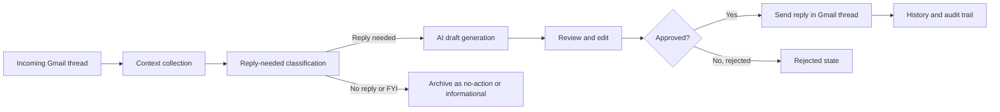
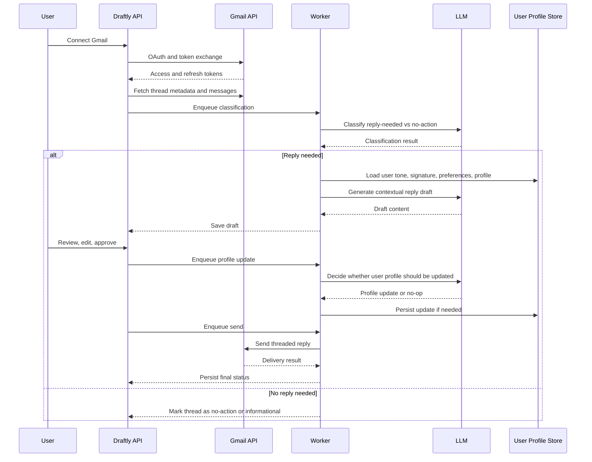
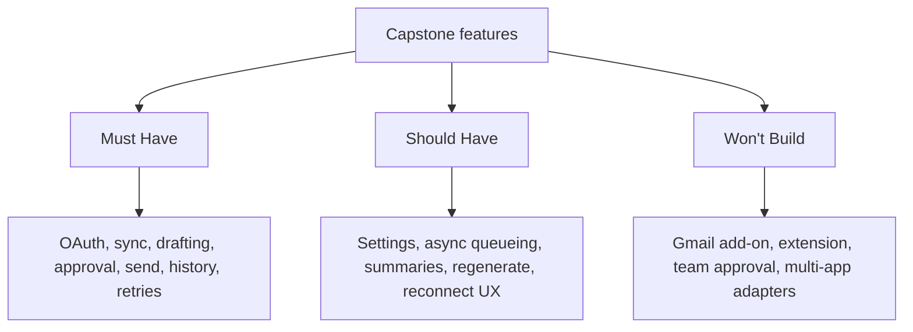
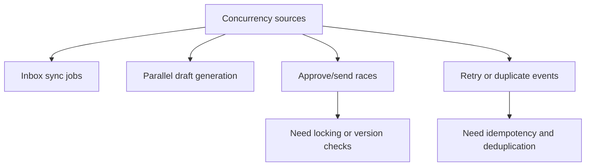
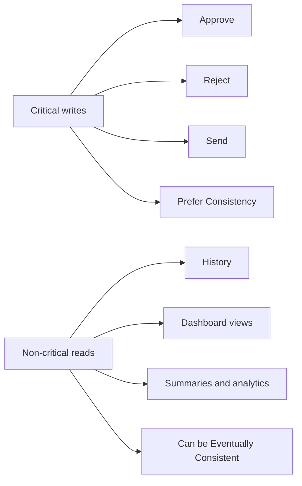
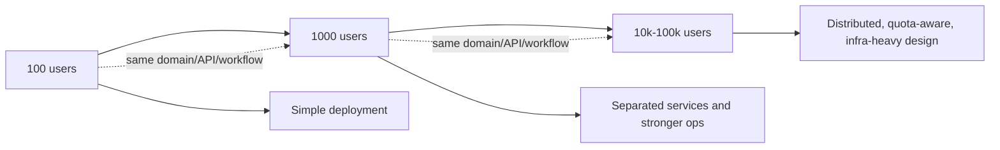

# Draftly Capstone Scope Freeze

## Objective

Build a capstone-grade backend system for Draftly: a human-in-the-loop Gmail AI reply assistant that fetches inbox messages, generates reply drafts using email context and recent sent-mail style, lets the user review and edit drafts, and sends only explicitly approved replies into the correct Gmail thread.

This document freezes the scope for the capstone phase so that schema, APIs, and architecture remain stable across the 100-user, 1000-user, and 10k-100k-user design views.

## Product Framing

Draftly is not being scoped as a generic "AI email app" for capstone. It is being scoped as an approval-first reply workflow for Gmail.

The primary value proposition for the capstone is:

- reduce repetitive email reply effort
- preserve user tone and style
- keep the human in control before send
- maintain Gmail threading and metadata correctness

## Scope Boundary

### In Scope

- Gmail OAuth2 account connection
- secure token storage and refresh flow
- encryption for stored OAuth tokens and user preferences
- inbox sync for relevant incoming emails
- thread and message metadata ingestion, including normalized core fields and raw metadata snapshot
- reply-needed classification and business-context triage
- AI-generated reply draft creation
- personalization using recent sent emails
- persisted user preferences and signature handling
- review, edit, approve, reject workflow
- approved-only Gmail reply send
- draft, send, and action history
- retry handling for recoverable failures
- idempotent send protection
- Gmail API quota-aware request handling
- audit logging and basic observability
- RESTful API-first backend

### Out of Scope

- multi-user team approval workflows
- shared inbox collaboration
- Gmail add-on or Chrome extension
- attachments in outbound reply flow
- new outbound compose flow
- multi-channel support such as Jira, Confluence, or Slack
- billing and subscription management
- analytics dashboards beyond operational logs/history
- autonomous auto-send without approval
- advanced ranking, prioritization, or agentic reasoning
- Google Calendar / Meet response workflows
- Google Drive / Docs / Slides access-request workflows

## Capstone Assumptions

- Single user per workspace in v1.
- Gmail is the only supported external integration.
- Draft generation is for reply use cases only, not fresh outbound email creation.
- Not every ingested email will proceed to draft generation; emails may be classified as reply-needed, informational, notification-only, or low-priority/no-action.
- The system stores normalized thread content and metadata required for the workflow, not a full mailbox mirror.
- "Full metadata" for capstone should be interpreted as all metadata required for reply generation, approval, threading integrity, auditability, and safe resend protection, while still avoiding a full mailbox replication design.
- Initial personalization can be bootstrapped from recent sent emails and then maintained through a bounded user profile, with periodic or fallback re-grounding from recent sent emails when needed.
- User-level preferences such as signature, preferred tone, and writing style hints should be persisted separately from per-thread context.
- If a longer-lived memory/profile layer is added, it should be configurable and treated as a supporting signal rather than the only source of personalization.
- The user can always manually edit a draft before approval.
- An email reply must never be sent unless it is in the `approved` state.
- The initial capstone UI can be a standalone dashboard rather than an embedded Gmail experience.

## Core User Workflow

1. User connects Gmail account through OAuth2.
2. System fetches relevant incoming email/thread metadata.
3. System classifies whether the email likely needs a reply or is informational/no-action.
4. System gathers contextual inputs from the thread, persisted user preferences, and the user profile, with recent sent emails used for onboarding, refresh, or fallback re-grounding.
5. System generates a reply draft.
6. User reviews the draft, edits if needed, then approves or rejects it.
7. Approved replies may contribute to updating the user's persisted writing profile or memory.
8. System sends only approved replies into the correct Gmail thread.
9. System records status, history, and delivery outcome.

## Capstone Feature Matrix

The feature matrix below is intentionally limited to capstone capabilities only.

### Must Have

- Gmail OAuth connect and reconnect flow
- token refresh support
- token-expiry detection and user-visible reconnect alert
- inbox/thread fetch for relevant messages
- metadata capture: sender, recipients, subject, thread id, message id, timestamps
- raw metadata/header snapshot retained for audit and threading safety
- lightweight email triage: reply-needed vs no-action/informational
- contextual draft generation
- tone/style personalization from recent sent mail
- persisted signature and user preference application
- encrypted token and preference storage
- draft lifecycle states
- review and edit before send
- approve and reject actions
- threaded reply sending through Gmail API
- send idempotency guard
- automatic retry for transient send failures
- Gmail API quota-aware backoff/handling
- persistence for threads, messages, drafts, actions, and send attempts
- error handling and retry for transient failures
- basic logs and operational audit trail

### Should Have

- per-user settings such as preferred tone or generation mode
- queue-based async processing for sync, generation, and send
- concise thread summary for easier review
- manual re-generate draft action
- finer business categories such as critical, notification, cc-only, bulk-thread
- configurable user memory/profile updated from approved replies

### Won't Build in Capstone

- Gmail-native side panel UI
- browser extension
- team approvals
- Jira and Confluence adapters
- smart routing to multiple LLMs
- fine-grained admin analytics
- automatic reply sending

## Domain Invariants

These invariants must remain true across all scales:

- Gmail is the source of truth for sent email delivery state.
- A reply can be sent only once for a given approved send attempt idempotency key.
- A draft belongs to exactly one thread context snapshot.
- A draft is generated only for emails classified as reply-needed.
- User signature and explicit preferences must be applied consistently when present.
- A user action is recorded for every approve, reject, edit, and send event.
- Thread integrity must be preserved using the appropriate Gmail thread/message metadata.
- API contracts and domain entities should remain stable across scale tiers even if deployment topology changes.

## Personalization and Memory Model

The case study explicitly asks the system to learn from a user's last few sent emails to infer style, tone, and phrasing preferences. A persisted user-level context layer can help, but it should complement rather than replace recent sent-email grounding.

### Why This Helps

- keeps tone more consistent across unrelated threads
- reduces repeated prompt reconstruction for every new draft
- gives a place to store explicit user preferences such as signature or preferred style
- lets approved replies reinforce the user's accepted communication patterns

### Recommended Capstone Position

- Treat personalization as two layers.
- Layer 1 is mandatory: explicit user preferences such as signature, preferred tone, or writing instructions plus a bounded user profile.
- Layer 2 is grounding support: recent sent emails are used during onboarding, scheduled refresh, or fallback re-grounding when the profile is missing, stale, or low-confidence.

### Preferred Cost-Efficient Strategy

- On first connect, fetch a bounded set of recent sent emails and build an initial user profile.
- Use the profile by default for most draft generations.
- Re-sample recent sent emails only when:
- the user is newly onboarded
- the profile has low confidence or is stale
- the user manually requests recalibration
- the generated output appears inconsistent with user edits or approvals

### Memory/Profile Update Strategy

- Trigger memory/profile review only after an approved reply.
- Let the LLM propose either `no_change` or a structured update.
- Persist only bounded, human-meaningful items such as:
- preferred greeting style
- preferred closing style
- signature template
- tone hints
- recurring priorities or communication norms

### Guardrails

- The memory/profile store should be configurable and externally dependent, not hard-wired into the core workflow.
- Memory should be bounded and structured, not an unbounded conversation log.
- Current thread context should remain higher-priority than the user profile.
- Recent sent-email re-grounding should override stale or low-confidence profile traits when necessary.
- Users should be able to inspect or reset persisted preferences later, even if that UI is not part of capstone v1.

## Email Triage Model

Not all emails deserve a generated draft. A lightweight triage layer is in scope because it improves user trust, cost efficiency, and product realism.

### Capstone Triage Outcome

- `reply_needed`
- `informational_no_action`
- `notification_or_subscription`
- `cc_or_bulk_low_priority`

### Capstone Triage Strategy

- Start simple and practical.
- Use a hybrid approach: metadata heuristics plus optional LLM classification.
- Generate drafts only for `reply_needed`.
- Store the classification result and reason for auditability.

### Triage Examples

- direct question from a client: `reply_needed`
- approval request or decision mail: `reply_needed`
- Jira notification: `notification_or_subscription`
- monthly newsletter: `notification_or_subscription`
- email where the user is only cc'd: `cc_or_bulk_low_priority`
- informational status update with no action requested: `informational_no_action`

## Known Exclusions and Future Scope

Some incoming Gmail items look like emails but actually represent external-action workflows. These should be explicitly excluded from capstone v1 because they require deeper integration than standard reply drafting.

### Excluded in v1

- Google Calendar or Google Meet invite responses
- Google Drive, Docs, or Slides access-request emails
- any workflow where the correct user action is not a normal email reply

### Why Excluded

- the correct action may require Calendar or Drive APIs rather than Gmail send
- the email itself may be informational while the real action lives in another Google product
- incorrect automation here can create user confusion or wrong business actions

### Future Direction

- classify these as `external_action_required`
- surface them in the review queue without generating a normal reply draft
- add dedicated adapters and action handlers when Calendar/Drive integrations are in scope

## Concurrency Assumptions

Concurrency does exist in this system, but it is not the primary product challenge. It appears in these places:

- multiple users syncing inboxes at the same time
- background workers generating drafts concurrently
- multiple approval/send actions happening close together
- duplicate delivery or retry events from external systems
- race conditions when a thread changes while a draft is under review

For capstone scope, we do not optimize for extreme concurrency. We optimize for safe and correct handling of moderate concurrency.

### Concurrency Design Requirements

- async jobs for inbox sync, draft generation, and sending
- row-level or logical locking around send attempts
- idempotency keys for dispatch
- versioning or optimistic checks on draft approval/send
- deduplication of repeated sync events
- retry safety for transient failures

### Concurrency Position by Scale

- 100 users: low to moderate concurrency, comfortably handled with one API service, one worker tier, Postgres, and Redis
- 1000 users: moderate concurrency, requires queue isolation, stronger worker separation, and better observability
- 10k-100k users: concurrency becomes infrastructure-significant, especially around Gmail quotas, queue throughput, retries, and external API coordination

## CAP Theorem Position

Draftly should be designed as a CP-leaning system for workflow state, with pragmatic availability for non-critical reads.

Reasoning:

- sending the wrong email or sending twice is worse than temporarily delaying an action
- approval state, send state, and idempotency correctness are more important than always-available writes during a partition
- workflow decisions must prefer correctness over stale conflicting writes

### Practical CAP Interpretation

- For critical write paths such as approve, reject, and send, prefer consistency over availability.
- For non-critical read paths such as history lists or dashboards, eventual consistency is acceptable.
- During failures or partitions, it is better to delay sending than to risk duplicate or invalid dispatch.

This means the business workflow is effectively:

- strongly consistent enough for workflow transitions
- eventually consistent for derived views, summaries, and analytics

## 100-User Design Goal

The 100-user design is the implementation target and the reference architecture for the capstone.

It must be:

- fully functional end to end
- locally runnable
- simple enough to build quickly
- structured so the same domain model and APIs can scale later

## Scale Continuity Rule

The following must stay the same across 100, 1000, and 10k-100k user designs:

- product workflow
- domain model
- approval rules
- core API contracts
- data ownership boundaries

The following may change across scale tiers:

- deployment model
- number of services
- queue/event infrastructure
- monitoring and alerting sophistication
- database topology and failover strategy

## Success Criteria for Capstone

The capstone scope is considered complete when:

- a user can connect Gmail successfully
- the system can ingest a relevant thread
- the system can generate a useful reply draft
- the user can review, edit, approve, or reject the draft
- the system can send the approved reply correctly into Gmail
- workflow state and history are persisted
- transient failure and duplicate send risks are handled reasonably
- the design can be credibly extended to higher-scale deployment

## Next Documents to Produce

After this scope freeze, the design work should proceed in this order:

1. Core solution design for 100 users
2. HLD for 1000 users and the changes from the 100-user design
3. System design for 10k-100k users
4. Unified domain schema and API design

---

## Addendum: Decided Implementation Clarifications

*Added post-design-freeze to resolve ambiguities. These are final implementation decisions.*

### 1. Scale Target (was ambiguous: "100-user, 1000-user, and 10k-100k-user design views")

**Decided:** We build for **1000 users, ~300 peak concurrent** from the start. The 100-user modular monolith from the original design is superseded. We skip directly to the 1000-user architecture because the extensibility and product-readiness requirements demand it. The 10k-100k design is deferred.

### 2. Service Topology (was: "modular monolith" assumed throughout)

**Decided:** **Dual-service architecture** — Node.js Gateway (API, OAuth, Gmail I/O) + Python AI Engine (triage, draft generation, profile updates). Not a modular monolith. The split is justified because AI is the product's core value and Python's ML/LLM ecosystem is significantly stronger. See [system-design-overview.md](./system-design-overview.md) for full decision record.

### 3. "Billing and subscription management" (was: explicitly out of scope)

**Decided:** **Billing is partially in scope.** We build **usage/cost tracking** (LLM tokens, Gmail API calls, per-user cost estimates) from day 1. Payment collection (Stripe) is deferred to product phase. Usage tracking is a prerequisite for billing and gives us unit economics data. See [billing-and-usage.md](./billing-and-usage.md).

### 4. "Single user per workspace in v1" (was: ambiguous if multi-user is planned)

**Decided:** The system supports **1000 independent users**, each with their own Gmail connection, profile, and drafts. "Single user per workspace" means there are no shared workspaces or team features. Each user is fully isolated. Row-level data isolation enforced at repository layer.

### 5. Authentication (was: "user login/session handling" — no specifics)

**Decided:** **OAuth-first (Google Login)** with incremental consent. Step 1: "Continue with Google" (openid, email, profile scopes) → auto-register + JWT. Step 2: "Enable AI Replies" → Gmail mail scopes. Traditional email/password registration is a secondary fallback for admin accounts and testing. See [authentication-and-security.md](./authentication-and-security.md).

### 6. LLM Provider (was: generic "LLM provider")

**Decided:** **Google Gemini** (free tier, direct API) for development and as default. **OpenRouter** for production when API key is available. Both are supported simultaneously via LiteLLM (provider-agnostic wrapper). Circuit breaker with automatic fallback between models.

### 7. "Queue-based async processing" (was: listed as "Should Have")

**Decided:** **Queue-based processing is a Must Have**, not Should Have. It's fundamental to the dual-service architecture. BullMQ (Node, for sync + send workers) and Celery (Python, for triage + draft + profile workers) both backed by Redis.

### 8. Multi-channel support (was: "out of scope" — Jira, Confluence, Slack)

**Decided:** Multi-channel **integration** is out of scope for capstone. However, the architecture is designed for extensibility via Workflow-first pattern with Connector Registry. Adding Jira/Calendar/Slack later requires zero changes to existing email reply code. The extensibility framework IS in scope; the actual integrations are not. See [extensibility.md](./extensibility.md).
