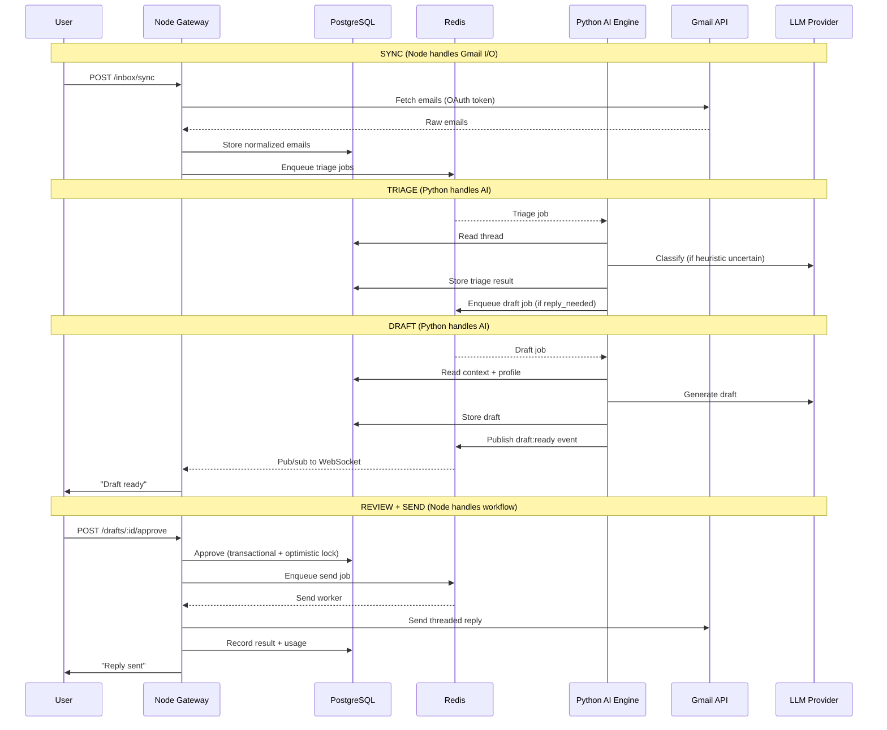

# Draftly — System Design Overview

**Scale target:** 1000 users, ~300 peak concurrent.
**Priority:** Backend completion → Local Docker testing → Frontend → Deployment.

---

## Architecture Pattern: Clean Architecture (Pragmatic)

### What it is
Four layers with strict dependency direction (inner layers don't know about outer):
```
Infrastructure → Interface → Application → Domain
```

### Why chosen

| Pattern | Verdict | Reason |
|---------|---------|--------|
| Simple Layered | ❌ Rejected | Business logic leaks everywhere. Adding Calendar/Jira means changes across all layers. Fine for CRUD, not for workflow-heavy systems. |
| Hexagonal (Ports & Adapters) | ❌ Rejected | Too ceremonious. Full port/adapter indirection adds files with no value when we have one API framework and a small team. |
| **Clean Architecture** | ✅ Chosen | Use Cases make workflows explicit. Domain layer is testable without infrastructure. Pragmatic — skip ceremony where it doesn't help. |
| Event Sourcing + CQRS | ❌ Rejected | Massive complexity. Great for financial audit trails, overkill for 1000 users on a capstone timeline. |

### When Clean Architecture would be wrong
- Throwaway prototypes (overhead not worth it)
- Pure CRUD with no business rules (a simple layered approach is faster)
- Solo dev who won't maintain the codebase beyond 3 months

---

## Service Topology: Dual-Service (Node.js + Python)

```
┌────────────────────┐    Redis Queues     ┌────────────────────┐
│  Node.js Gateway   │◄══════════════════►│  Python AI Engine  │
│  (API + I/O)       │    Shared Postgres  │  (AI + Workflows)  │
│                    │◄══════════════════►│                    │
└────────────────────┘                    └────────────────────┘
         │                                         │
    Gmail API                                 OpenRouter / Gemini
```

### Why not a single service

| Option | Verdict | Reason |
|--------|---------|--------|
| Node.js monolith | ❌ | Node AI/ML ecosystem is weak. LiteLLM, LangChain, token counting — all Python-first. CPU-heavy prompt parsing blocks the event loop. |
| Python monolith | ❌ | Python async is mature but Node is battle-tested for high-concurrency WebSocket + REST. OAuth/session middleware richer in Node. |
| **Node + Python** | ✅ | Best-of-breed. Node does I/O (API, OAuth, Gmail, WebSocket). Python does AI (triage, drafting, profiling, LLM). Independent scaling. |
| Node + Python sidecar | ❌ | If Python only proxies to OpenRouter, why bother? We have pipelines, prompt chains, validation — Python needs a full home. |

### What this costs us
- Docker Compose required for local dev (acceptable — already planned)
- Correlation IDs needed for cross-service debugging
- Schema changes affect both services
- Two Dockerfiles, two CI pipelines

### Service Responsibility Split

| Responsibility | Node.js Gateway | Python AI Engine |
|---|:---:|:---:|
| REST API + WebSocket | ✅ | — |
| Authentication (JWT, OAuth) | ✅ | — |
| Gmail API I/O (fetch, send) | ✅ | — |
| Token encryption/storage | ✅ | — |
| Rate limiting | ✅ | — |
| Billing/usage tracking | ✅ | ✅ reports |
| DB CRUD (primary) | ✅ | reads + writes results |
| Triage pipeline | — | ✅ |
| Draft generation | — | ✅ |
| Profile analysis | — | ✅ |
| LLM interaction | — | ✅ |
| Prompt management | — | ✅ |

---

## High-Level Data Flow



---

## Technology Stack Summary

| Layer | Node.js Gateway | Python AI Engine |
|-------|----------------|-----------------|
| Language | TypeScript (strict) | Python 3.12 |
| Framework | Express 5 | FastAPI |
| Task Queue | BullMQ | Celery 5 |
| DB Access | Knex.js (query builder) | SQLAlchemy 2.0 (async) |
| Validation | Zod | Pydantic v2 |
| Auth | Passport.js + custom JWT | — |
| LLM Client | — | LiteLLM |
| Logging | Pino | structlog |
| Testing | Jest + Supertest | pytest + pytest-asyncio |
| Encryption | Node crypto (AES-256-GCM) | — |

LLM provider compatibility: **OpenRouter** (primary, when available) + **Google Gemini** (free tier, for development and fallback). LiteLLM abstracts both behind one interface.

---

## What This Document Does NOT Cover

Each of these has its own detailed doc:

- [Gateway Service Design](./gateway-service.md)
- [AI Engine Service Design](./ai-engine-service.md)
- [Inter-Service Communication](./inter-service-communication.md)
- [Database Design](./database-design.md)
- [Authentication & Security](./authentication-and-security.md)
- [API Contracts](./api-contracts.md)
- [Extensibility Framework](./extensibility.md)
- [Billing & Usage Tracking](./billing-and-usage.md)
- [Deployment](./deployment.md)
